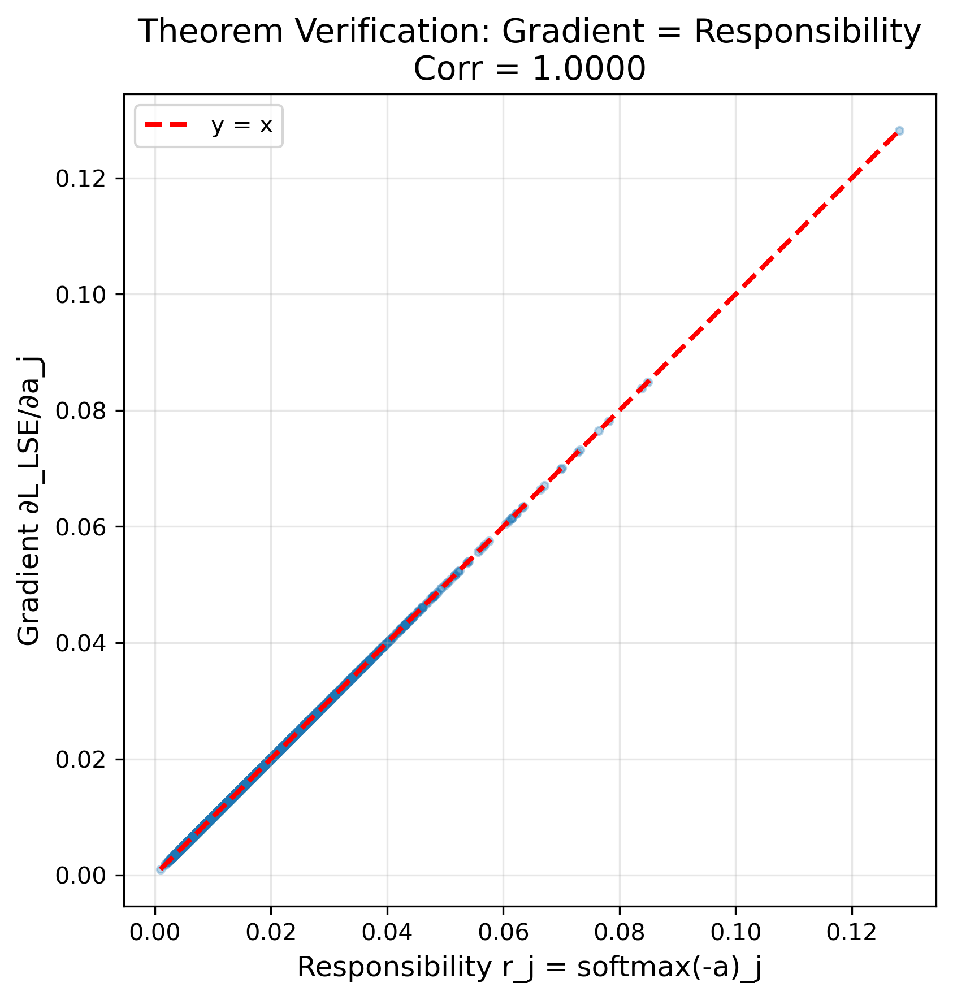

# Deriving Decoder-Free Sparse Autoencoders from First Principles

## Abstract

Recent work established that log-sum-exp objectives perform expectation-maximization implicitly: the gradient with respect to each component energy equals its responsibility. That theory also predicts collapse—without volume control analogous to the log-determinant in Gaussian mixture models, components degenerate. We ask whether implicit EM theory can derive working models from first principles. We construct the model the theory prescribes: a single-layer encoder with LSE objective and InfoMax regularization as neural volume control. Experiments validate every theoretical prediction: the gradient-responsibility identity holds exactly; LSE alone collapses; variance prevents death (diagonal of log-det); decorrelation prevents redundancy (off-diagonal); the full objective learns interpretable features. Training dynamics are unusual: Adam's typical advantages disappear, and lower loss does not yield better features—consistent with the well-conditioned structure of implicit EM. The learned features are mixture components—digit prototypes—not dictionary elements. The theory-derived model outperforms standard sparse autoencoders on downstream tasks with half the parameters. This validates implicit EM as a foundation for principled model design.

---

## 1. Introduction

Deep learning models are typically designed through intuition and experimentation, with theory following to explain what works. This paper inverts the process. We begin with a theory—implicit EM in neural networks—derive the model it prescribes, and test whether the prescription succeeds. The theory makes specific predictions: what architecture is required, what objective to use, what failure modes will occur without each component. We build exactly what the theory specifies and validate every prediction. The result is a model that outperforms heuristically-designed alternatives, not because we optimized for benchmarks, but because principled derivation yields coherent design.

### 1.1 Implicit EM Theory

Prior work establishes that gradient descent on log-sum-exp objectives performs expectation-maximization implicitly (Oursland, 2025). The key result is an algebraic identity: for any LSE objective over component energies, the gradient with respect to each energy equals its responsibility—the posterior probability that the component explains the input. This is exact, not approximate. The forward pass computes responsibilities via softmax; the backward pass delivers them as gradients; parameter updates are the M-step.

This identity becomes meaningful under the distance-based interpretation of neural networks (Oursland, 2024). If outputs are understood as energies—distances from learned prototypes, where low values indicate proximity—then the softmax is not merely a normalization but an assignment: responsibilities that sum to one across competing components. Section 2 develops this interpretation in detail.

The theory also identifies a gap. Classical mixture models include a log-determinant term that prevents collapse: components cannot shrink to points or duplicate each other. Neural LSE objectives lack this term. The implicit EM machinery is present, but the safeguards are not. Without explicit volume control, representations will degenerate—a prediction we will test directly.

### 1.2 The Question

Theories can explain or they can prescribe. An explanatory theory redescribes existing models in new language—useful for understanding, but not for building. A prescriptive theory specifies what to build from first principles—and risks falsification if the specification fails.

This paper asks whether implicit EM theory is prescriptive. The question is not "Can we improve sparse autoencoders?" That would treat the theory as a source of tricks to optimize existing designs. The question is: "Does the theory prescribe something that works?" If we build exactly what implicit EM specifies—nothing more, nothing less—do we get a functioning model? Do the predicted failure modes appear when components are removed? Do the predicted behaviors emerge when the full system is trained?

A positive answer would validate implicit EM as a foundation for principled model design. A negative answer would confine it to post-hoc interpretation.

### 1.3 This Paper

We construct the model that implicit EM theory specifies. The architecture is minimal: a linear layer followed by ReLU, computing energies as distances to learned prototypes. The objective combines LSE—which provides implicit EM dynamics—with InfoMax regularization as volume control. Variance penalties prevent collapse; decorrelation penalties prevent redundancy. These are the neural equivalents of the log-determinant term in Gaussian mixture models.

Every component traces to a theoretical requirement. The architecture follows from the need to compute energies. The LSE term follows from the implicit EM identity. The InfoMax terms follow from the volume control gap. We add nothing for empirical convenience; we omit nothing the theory requires.

The result is a decoder-free sparse autoencoder—or equivalently, a neural mixture model. There is no reconstruction loss, no L1 sparsity penalty, no decoder weights. The model learns sparse, interpretable features through competition alone: components specialize because the objective rewards specialization.

Experiments validate the theoretical predictions. We verify the gradient-responsibility identity exactly. We show that LSE alone collapses, that variance prevents death, that decorrelation prevents redundancy. We compare against standard sparse autoencoders and find that the theory-derived model outperforms heuristic design with half the parameters.

### 1.4 Contribution

This paper makes three contributions:

**Implicit EM theory is generative.** The theory does not merely redescribe existing models—it prescribes new ones. We derive an architecture and objective from first principles, build exactly what the theory specifies, and show that it works. This establishes implicit EM as a foundation for principled model design, not just post-hoc interpretation.

**Every theoretical prediction is validated.** The gradient-responsibility identity holds to floating-point precision. LSE alone collapses as predicted. Variance prevents dead units; decorrelation prevents redundancy. Training dynamics exhibit the learning-rate insensitivity expected from EM structure. Learned features are mixture components—digit prototypes—not unstructured projections.

**Principled derivation outperforms heuristic design.** The theory-derived model achieves higher probe accuracy than standard sparse autoencoders (93.4% vs 90.3%) with half the parameters and no decoder. This is not because we optimized for the benchmark; it is because the objective does the right thing by construction. Heuristic models accumulate compensatory mechanisms; derived models need none.

### 1.5 Roadmap

Section 2 develops the theoretical foundation: distance-based representations, the LSE identity, and volume control via InfoMax. Section 3 instantiates this prescription as a concrete model. Section 4 validates each theoretical prediction experimentally. Section 5 discusses implications—why the theory-derived model outperforms, why decoders appeared necessary, and what the optimization results reveal.

---

## 2. What Implicit EM Theory Prescribes

This section develops the theoretical foundation from which our model is derived. We do not propose an architecture and ask whether it works; we ask what architecture the theory requires.

The derivation proceeds in four steps. First, we adopt the distance-based interpretation of neural network outputs, which provides the geometric substrate for what follows (Section 2.1). Second, we present the log-sum-exp identity: for LSE objectives, the gradient with respect to each component energy equals its responsibility, implying that gradient descent performs expectation-maximization implicitly (Section 2.2). Third, we identify a gap: neural LSE objectives lack the volume control that prevents collapse in classical mixture models (Section 2.3). Fourth, we fill this gap by identifying InfoMax regularization—variance and decorrelation penalties—as the neural equivalent of the log-determinant (Section 2.4). The section concludes with a summary mapping each theoretical requirement to its implementation (Section 2.5).

The result is a complete specification. The theory prescribes distances, an LSE objective, and volume control. Section 3 instantiates this prescription as a concrete model.

### 2.1 Distance-Based Representations

The standard interpretation of neural network outputs treats them as confidences or scores: a high output indicates strong evidence for a hypothesis. This interpretation, while intuitive, obscures the geometric structure underlying what neural networks compute.

An alternative interpretation reframes outputs as distances or energies relative to learned prototypes (Oursland, 2024). Under this view, a linear layer followed by an activation computes a quantity that behaves as a deviation from a learned reference. Consider a linear transformation $z = Wx + b$ followed by ReLU. Each row $w_j$ of $W$ defines a direction in input space; the bias $b_j$ defines an offset along that direction. The output $\phi(z_j)$ measures how far the input lies from a decision boundary—a distance, not a similarity.

This interpretation has a precise mathematical grounding. The Mahalanobis distance of a point $x$ from a Gaussian component with mean $\mu$ and precision along principal direction $v$ scaled by eigenvalue $\lambda$ is $|\lambda^{-1/2} v^\top (x - \mu)|$, which takes the form $|Wx + b|$ for appropriate $W$ and $b$. Standard ReLU networks compute this via the identity $|z| = \text{relu}(z) + \text{relu}(-z)$, decomposing signed distance into two half-space detectors.

The key shift is semantic, not computational. The same neural network performs the same operations; what changes is how we interpret the outputs. Low activation indicates proximity to a prototype. High activation indicates deviation. Probabilities are not primitive quantities but derived ones, arising only after exponentiation and normalization transform distances into relative likelihoods.

Throughout this paper, we adopt the distance-based interpretation: **lower energy means better explanation**. A component with low energy for an input "claims" that input with high responsibility. This convention, standard in energy-based models (LeCun et al., 2006), is essential for the results that follow. The identification of gradients with responsibilities (Section 2.2) depends on this geometric framing.

### 2.2 The LSE Identity

Consider an encoder that maps an input $x$ to $K$ component energies $E_1(x), \ldots, E_K(x)$. Following Section 2.1, lower energy indicates a better match. Given these energies, define the log-sum-exp marginal objective:

$$L_{\text{LSE}}(x) = -\log \sum_{j=1}^{K} \exp(-E_j(x)) \tag{1}$$

This objective has a natural interpretation: it is minimized when at least one component has low energy for the input. It encodes the requirement that *some* component must explain each data point—the same intuition underlying mixture models (Bishop, 2006).

The key property of this objective is an exact algebraic identity (Oursland, 2025). Taking the gradient with respect to any component energy:

$$\frac{\partial L_{\text{LSE}}}{\partial E_j} = \frac{\exp(-E_j)}{\sum_{k=1}^{K} \exp(-E_k)} = r_j \tag{2}$$

where $r_j$ is the softmax responsibility—the posterior probability that component $j$ explains the input, given the current energies.

This identity is not an approximation. It is not a first-order expansion or an asymptotic result. The gradient with respect to each component energy *is* its responsibility, exactly, for any differentiable parameterization of the energies.

The consequence for learning is immediate. In classical expectation-maximization (Dempster et al., 1977), the E-step computes responsibilities and the M-step updates parameters using responsibility-weighted statistics. These steps alternate explicitly. With LSE objectives, this separation dissolves:

- **The forward pass computes energies.** These determine the responsibilities implicitly through the softmax in Equation 2.
- **The backward pass computes gradients.** By Equation 2, these gradients *are* the responsibilities.
- **The optimizer step updates parameters.** Each component receives gradient signal proportional to its responsibility for the input.

No auxiliary E-step is required. Responsibilities emerge automatically from backpropagation. The optimizer update constitutes the M-step, moving each component according to how much responsibility it claimed. Gradient descent on LSE objectives *is* expectation-maximization, performed continuously rather than in discrete alternating steps.

This structure already pervades deep learning. Cross-entropy classification has LSE form: $L = -z_y + \log \sum_k \exp(z_k)$, where $z_y$ is the logit for the correct class. The softmax probabilities that appear in the gradient are precisely the responsibilities—the posterior probability assigned to each class. The ubiquity of cross-entropy may explain why neural networks exhibit mixture-model behaviors despite lacking explicit probabilistic structure: the implicit EM dynamics are present in the objective itself.

### 2.3 The Volume Control Requirement

The LSE identity (Equation 2) provides a mechanism for learning: responsibility-weighted gradient updates that implement implicit EM. But mechanism is not objective. The identity tells us *how* parameters update; it does not tell us *what* will be learned.

For supervised learning, the objective is clear. Cross-entropy loss has LSE structure, and target labels define the desired outcome. The responsibilities (softmax outputs) are trained to match the labels. Mechanism and objective work together.

For unsupervised learning, the situation is different. There are no labels. The LSE marginal in Equation 1 provides a candidate objective: minimize the energy of the best-matching component for each input. Intuitively, this says "at least one component should explain each data point." But this objective alone, without additional constraints, admits degenerate solutions.

**The collapse problem.** Consider what happens if a single component $j^*$ learns to produce low energy for all inputs. Its responsibility $r_{j^*} \to 1$ across the dataset, while all other responsibilities $r_{j \neq j^*} \to 0$. By Equation 2, the gradient with respect to other components vanishes. They receive no learning signal. They die.

The result is a collapsed representation: one component that responds to everything, and $K-1$ components that respond to nothing. The encoder has satisfied the LSE objective—every input is explained—but the representation carries no more information than a constant.

**The mixture model precedent.** This failure mode is not unique to neural networks. Gaussian mixture models face the same challenge, and their solution is instructive. The log-likelihood of a data point under a GMM component includes a log-determinant term:

$$\log P(x \mid k) \propto -\frac{1}{2}(x - \mu_k)^\top \Sigma_k^{-1}(x - \mu_k) - \frac{1}{2}\log\det(\Sigma_k)$$

The first term is the Mahalanobis distance. The second term, the log-determinant, is crucial: it penalizes components with small covariance (Bishop, 2006). Without it, a component could shrink to a point, placing infinite density on any data point it sits on. The log-determinant enforces volume—each component must maintain a region of support, not a singularity.

**The missing term.** Neural LSE objectives have no equivalent. The encoder computes energies $E_j(x)$, and the LSE loss aggregates them, but nothing constrains the *distribution* of those energies across the dataset. A component can produce uniformly low energy (claiming everything) or uniformly high energy (claiming nothing) without penalty.

The theory thus makes a clear prediction: without explicit volume control, neural implicit EM will collapse. This is not a risk to be managed but a certainty to be addressed. Section 2.4 identifies the solution.

### 2.4 The Prescribed Solution

The collapse problem identified in Section 2.3 has a known solution in the mixture model literature. Gaussian mixture models include a log-determinant term $\log \det(\Sigma)$ that prevents degenerate covariances. This term can be decomposed into two distinct roles, each addressing a different failure mode.

**The diagonal role.** For a covariance matrix with eigenvalues $\lambda_1, \ldots, \lambda_K$, the log-determinant is $\sum_j \log \lambda_j$. When outputs are uncorrelated (diagonal covariance), this reduces to $\sum_j \log \text{Var}(A_j)$. This term diverges to negative infinity as any variance approaches zero. A component cannot collapse to a point—cannot produce constant output across all inputs—without incurring unbounded penalty. The diagonal of the log-determinant enforces existence: every component must maintain non-zero variance.

**The off-diagonal role.** The full log-determinant also depends on the correlations between components. If two components are perfectly correlated, the covariance matrix becomes singular and its determinant is zero—the log-determinant diverges. More generally, correlated components reduce the determinant below what uncorrelated components with the same variances would achieve. The off-diagonal structure enforces diversity: components cannot be redundant copies of each other.

Neural LSE objectives lack both terms. The implicit EM machinery provides responsibility-weighted updates, but nothing constrains the distributional properties of the activations. We must supply the missing volume control explicitly.

**Variance penalty.** We introduce a term that penalizes components with low variance across the dataset:

$$L_{\text{var}} = -\sum_{j=1}^{K} \log \text{Var}(A_j)$$

This is precisely the negative of what the diagonal log-determinant contributes in the uncorrelated case. The logarithmic barrier ensures that collapse is not merely discouraged but forbidden: as $\text{Var}(A_j) \to 0$, the penalty diverges. Under Gaussian assumptions, log-variance is proportional to differential entropy (Linsker, 1988), so maximizing this term encourages high marginal entropy—each component should transmit maximal information about its inputs.

**Decorrelation penalty.** We introduce a term that penalizes correlations between components:

$$L_{\text{tc}} = \|\text{Corr}(A) - I\|_F^2$$

where $\text{Corr}(A)$ is the correlation matrix computed over the dataset and $I$ is the identity. This penalty is zero when all components are uncorrelated and grows with off-diagonal correlations. Decorrelation approximates statistical independence at the level of second-order statistics (Bell & Sejnowski, 1995). It forces components to encode different structure: two components that respond identically to all inputs will be heavily penalized.

**Role equivalence.** The correspondence between GMM volume control and InfoMax regularization is summarized in the following table:

| GMM Term | Neural Equivalent | Function |
|----------|-------------------|----------|
| $\log \det(\Sigma)$ diagonal | $-L_{\text{var}} = \sum_j \log \text{Var}(A_j)$ | Prevent dead components |
| $\log \det(\Sigma)$ off-diagonal | $-L_{\text{tc}}$ (via decorrelation) | Prevent redundant components |

When activations are uncorrelated, the log-determinant of a diagonal covariance matrix equals $\sum_j \log \text{Var}(A_j)$. The decorrelation penalty enforces the condition that makes this equivalence hold. Together, the two terms constrain the full covariance structure of the representation.

This completes the prescription. Implicit EM theory specifies three requirements: compute energies, optimize an LSE objective, include volume control. The first two were established in Sections 2.1–2.2. The variance and decorrelation penalties provide the third. Section 3 assembles these components into a complete model.

### 2.5 Summary: The Theory-Specified Model

The preceding sections establish what implicit EM theory requires. Each component of the model we will present traces to a specific theoretical source:

| Component | Theory Source | Implementation |
|-----------|---------------|----------------|
| Distances | Oursland (2024) | Linear layer: $z = Wx + b$ |
| Activation | Distance interpretation | ReLU or softplus |
| EM structure | Oursland (2025) | LSE objective (Equation 1) |
| Volume control (diagonal) | GMM analogy | Variance penalty |
| Volume control (off-diagonal) | GMM analogy | Decorrelation penalty |

The linear layer computes distances to learned prototypes (Section 2.1). The LSE objective provides implicit EM dynamics, with gradients equal to responsibilities (Section 2.2). The variance penalty prevents collapse by ensuring every component maintains non-zero dispersion (Section 2.4). The decorrelation penalty prevents redundancy by ensuring components encode distinct structure (Section 2.4).

No component is added for empirical convenience. No hyperparameter is introduced without theoretical justification. The architecture follows from the requirement to compute energies; the objective follows from the requirement to perform implicit EM with volume control.

The model is not designed. It is derived.

Section 3 presents the complete instantiation.

---

## 3. The Derived Model

Section 2 established what implicit EM theory prescribes: a model that computes energies, optimizes a log-sum-exp objective, and includes volume control analogous to the log-determinant in Gaussian mixture models. This section instantiates that prescription.

We present the minimal architecture required (Section 3.1) and the complete objective combining LSE with InfoMax regularization (Section 3.2). We then characterize what this model is from three perspectives—architectural, theoretical, and methodological (Section 3.3). To build intuition for why the objective produces useful representations, we analyze the dynamics that emerge from the tension between attraction and structure (Section 3.4). Finally, we state the theoretical predictions that follow from the framework, which Section 4 will test empirically (Section 3.5).

The model presented here is not designed but derived. Every component traces back to a theoretical requirement: the linear layer computes distances (Oursland, 2024), the LSE term provides implicit EM structure (Oursland, 2025), and the InfoMax terms supply volume control (Section 2.4). We add nothing beyond what the theory specifies.

### 3.1 Architecture

The implicit EM framework places minimal constraints on architecture. The identity in Equation 2 holds for any differentiable parameterization of the energies $E_j(x)$ (Oursland, 2025). We therefore adopt the simplest instantiation: a single linear layer followed by a nonlinearity.

$$z = Wx + b, \qquad E = \phi(z) \tag{3}$$

Here $W \in \mathbb{R}^{K \times D}$ maps inputs $x \in \mathbb{R}^D$ to $K$ pre-activation values $z$, the bias $b \in \mathbb{R}^K$ shifts each component, and the activation function $\phi$ produces the final energies $E$.

This architecture has a geometric interpretation. Under the distance-based view of neural networks (Oursland, 2024), each row of $W$ defines a prototype direction in input space. The pre-activation $z_j = w_j^\top x + b_j$ measures the signed projection of the input onto prototype $j$, offset by $b_j$. The activation $\phi$ then converts this projection into an energy, following the convention that lower energy indicates a better match (LeCun et al., 2006).

The choice of activation affects the geometry of the energy landscape but not the implicit EM property. We consider two options:

- **ReLU:** $\phi(z) = \max(0, z)$. Produces non-negative energies. Inputs yielding $z_j < 0$ have zero energy for component $j$—indicating a strong match. The rectification introduces sparsity in the energy representation (Glorot et al., 2011).

- **Softplus:** $\phi(z) = \log(1 + \exp(z))$. A smooth approximation to ReLU that avoids the discontinuous gradient at zero while maintaining non-negative energies.

The responsibilities need not be computed explicitly during training. By Equation 2, they appear implicitly in the gradients. For analysis and visualization, they can be recovered as:

$$r = \text{softmax}(-E) \tag{4}$$

Critically, the architecture contains no decoder. There is no matrix mapping activations back to input space, and no reconstruction loss. The encoder alone constitutes the model—a direct consequence of deriving the objective from implicit EM rather than from reconstruction.

### 3.2 Complete Objective

Combining the implicit EM structure from Section 2.2 with the volume control from Section 2.4, we arrive at the complete objective:

$$L = -\log \sum_{j=1}^{K} \exp(-E_j) - \lambda_{\text{var}} \sum_{j=1}^{K} \log \text{Var}(A_j) + \lambda_{\text{tc}} \|\text{Corr}(A) - I\|_F^2 \tag{5}$$

Each term serves a distinct and theoretically motivated purpose.

**Term 1: Log-sum-exp.** The LSE term provides the implicit EM structure established in Section 2.2. By Equation 2, its gradient with respect to each energy equals the responsibility, yielding responsibility-weighted parameter updates (Oursland, 2025). This term encodes the requirement that at least one component should explain each input—the same intuition underlying mixture models (Bishop, 2006). It acts as an attractive force, pulling components toward regions of the data manifold they can explain.

**Term 2: Variance penalty.** This term corresponds to the diagonal of the log-determinant in Gaussian mixture models (Section 2.5). A component with zero variance across the dataset has collapsed—it produces identical output for all inputs and carries no information. The logarithmic barrier ensures that variance cannot approach zero: as $\text{Var}(A_j) \to 0$, the penalty diverges. Under Gaussian assumptions, log-variance is proportional to entropy (Linsker, 1988), so this term can be viewed as encouraging high marginal entropy for each component. The hyperparameter $\lambda_{\text{var}}$ controls the strength of this constraint.

**Term 3: Decorrelation penalty.** This term corresponds to the off-diagonal structure of the log-determinant. Correlated components encode redundant information; in the limit of perfect correlation, one component is a linear function of another and contributes nothing new. Penalizing deviation from the identity correlation matrix encourages statistical independence at the level of second-order statistics (Bell & Sejnowski, 1995). This same regularizer appears in recent self-supervised learning methods—Barlow Twins (Zbontar et al., 2021) and VICReg (Bardes et al., 2022)—providing independent evidence of its effectiveness as a collapse-prevention mechanism. The hyperparameter $\lambda_{\text{tc}}$ controls the strength of this constraint.

Together, the variance and decorrelation terms constrain the full covariance structure of the activations, playing the role that $\log \det(\Sigma)$ plays in classical mixture models. When activations are uncorrelated, the log-determinant of a diagonal covariance matrix reduces to $\sum_j \log \text{Var}(A_j)$—precisely the negative of Term 2. The decorrelation penalty enforces the condition that makes this equivalence hold.

Notably, no reconstruction term appears. Standard sparse autoencoders include a loss of the form $\|x - \hat{x}\|^2$ that anchors features to input fidelity (Vincent et al., 2008). Our objective replaces reconstruction with volume control: information preservation emerges from the requirement that components be active (variance) and distinct (decorrelation), rather than from explicit input matching.

For some architectures, an additional weight regularization term may be beneficial:

$$L_{\text{wr}} = \lambda_{\text{wr}} \|W^\top W - I\|_F^2 \tag{6}$$

This penalty encourages orthogonality among the encoder's weight vectors, preventing multiple components from learning identical directions in input space (Oursland, 2024). We treat this as optional; our primary experiments use only Equation 5.

### 3.3 What This Model Is

The architecture in Equation 3 and objective in Equation 5 admit three complementary descriptions, each illuminating a different aspect of the model.

**A decoder-free sparse autoencoder.** Architecturally, this model resembles a sparse autoencoder with the decoder removed. Standard SAEs map inputs through an encoder to a sparse bottleneck, then reconstruct via a decoder, training on reconstruction loss plus L1 sparsity penalty (Olshausen & Field, 1996; Bricken et al., 2023). Our model retains only the encoder. There is no reconstruction term, no decoder weights, and no explicit sparsity penalty. Yet as we show in Section 4, the model learns sparse, interpretable features comparable to those of standard SAEs. The decoder, it turns out, was compensating for missing structure in the objective—structure we now provide directly through volume control.

**A neural mixture model.** Theoretically, this model is a mixture model implemented in neural network form. Each row of $W$ defines a component; the energies $E_j(x)$ measure how well each component explains the input; the responsibilities $r_j = \text{softmax}(-E)_j$ give the posterior probability of component assignment. The LSE objective is the negative log marginal likelihood—the standard mixture model objective (Bishop, 2006). The InfoMax terms play the role of the log-determinant, preventing components from collapsing or duplicating. Training proceeds by implicit EM: the forward pass computes (unnormalized) likelihoods, backpropagation delivers responsibility-weighted gradients, and the optimizer updates component parameters accordingly (Oursland, 2025). This is not an analogy. The mathematics are identical; only the parameterization differs.

**The simplest instantiation of implicit EM theory.** From the perspective of this paper, the model is a minimal test case. We asked: what does implicit EM theory prescribe? The answer is a model that computes energies (Section 2.1), optimizes an LSE objective (Section 2.2), and includes volume control (Section 2.4). Equation 3 is the simplest architecture that computes energies. Equation 5 is the complete objective the theory requires. We added nothing beyond what the theory specifies—no architectural innovations, no auxiliary losses, no tricks. The model exists to validate the theory, not to achieve state-of-the-art performance. That it performs well (Section 4) is evidence that the theory captures something true about representation learning.

These three descriptions are not competing interpretations but different lenses on the same object. The architectural lens connects to the SAE literature and motivates practical applications in interpretability. The mixture model lens provides theoretical grounding and explains the model's behavior. The implicit EM lens explains why the model takes this particular form—it is not designed but derived.

### 3.4 Dynamics: Attraction vs Structure

The objective in Equation 5 creates a tension between two forces. Understanding this tension clarifies why the model learns useful representations rather than collapsing to trivial solutions.

#### The LSE Term is Attractive

The log-sum-exp term $-\log \sum_j \exp(-E_j)$ acts as an attractive force, pulling components toward the data. Minimizing this term is equivalent to maximizing the likelihood that at least one component explains each input—the standard mixture model objective (Bishop, 2006).

A component reduces its contribution to the loss by lowering its energy for inputs it can explain well. The gradient identity (Equation 2) ensures this attraction is responsibility-weighted: components that already claim high responsibility for an input receive stronger gradients for that input. This is the implicit M-step—prototypes move toward the data points they are responsible for (Oursland, 2025).

Left unchecked, this attraction leads to collapse. A single component can lower its energy for all inputs, driving its responsibility toward one across the dataset. Other components receive vanishing gradient and die. The representation degenerates to a constant—the failure mode described in Section 2.3.

#### The InfoMax Terms are Structural

The variance and decorrelation penalties oppose collapse by constraining *how* components can reduce their energy, without dictating *where* they should go.

The variance term forces selectivity. To maintain high variance, a component cannot produce similar energies for all inputs. It must respond strongly to some inputs (low energy, high responsibility) and weakly to others (high energy, low responsibility). A component that tries to claim everything will have low variance and incur a large penalty.

The decorrelation term forces diversity. To remain uncorrelated with other components, each must capture different structure in the data. Two components that respond identically—or even proportionally—will be penalized. This prevents the redundancy that would otherwise emerge when multiple components converge to similar solutions.

Together, these terms act as structural constraints on the implicit EM dynamics. The LSE term provides the attractive force that drives learning; the InfoMax terms shape that force into a useful equilibrium.

#### The Equilibrium is Competitive Coverage

Under these opposing forces, the system settles into a state of competitive coverage. Components distribute themselves to tile the data manifold, each specializing in a region of input space.

A component at equilibrium achieves low energy (high responsibility) for inputs in its region and high energy (low responsibility) elsewhere. It cannot expand to claim more territory without either reducing its variance (penalized by Term 2) or overlapping with other components (penalized by Term 3). The result is a soft partition of the input space, with responsibilities encoding the degree of membership.

This dynamic resembles competitive learning in self-organizing maps (Kohonen, 1982), where prototypes distribute themselves through attraction to data and mutual repulsion. The key difference is that our framework is fully probabilistic: soft responsibilities replace hard winner-take-all assignments, and the equilibrium emerges from a well-defined objective rather than heuristic update rules. The implicit EM structure (Section 2.2) ensures that the learning dynamics correspond to maximum likelihood estimation under a mixture model.

#### Sparsity is Emergent

Equation 5 contains no explicit sparsity penalty—no L1 norm on activations, no regularizer encouraging zeros. Yet sparse representations arise naturally.

When components specialize, each input falls squarely in the territory of only a few components. These components have low energy (high activation after conversion); the rest have high energy (low or zero activation). The responsibility distribution concentrates: for a typical input, one or two components claim most of the probability mass while others have near-zero responsibility.

This emergent sparsity differs fundamentally from the L1-induced sparsity of standard sparse autoencoders (Olshausen & Field, 1996). L1 regularization forces activations toward zero regardless of whether the data support sparse representations. Our model produces sparsity only when the data admit a covering by localized components—sparsity as a consequence of structure, not as an imposed constraint.

The ReLU activation reinforces this effect. Components with high energy (poor matches) produce zero activation after rectification, contributing exact sparsity rather than merely small values (Glorot et al., 2011). The combination of competitive dynamics and rectification yields representations that are both sparse and meaningful.

### 3.5 Theoretical Predictions

The framework developed in Sections 2 and 3 makes specific, testable predictions. These predictions follow directly from the theory; they were established before any experiments were conducted. Section 4 presents empirical validation.

| Prediction | Theoretical Source |
|------------|-------------------|
| Gradient equals responsibility exactly | LSE identity (Equation 2) |
| LSE alone collapses | Missing volume control (Section 2.3) |
| Variance term prevents dead units | Diagonal of log-determinant (Section 2.4) |
| Decorrelation prevents redundancy | Off-diagonal of log-determinant (Section 2.4) |
| Features are mixture components | Implicit EM interpretation (Section 2.2) |
| SGD converges in fixed iterations | EM determines iteration count |

**Prediction 1: Gradient equals responsibility.** Equation 2 is an algebraic identity, not an approximation (Oursland, 2025). For any LSE objective over energies, the gradient with respect to each energy is exactly the softmax responsibility. This should hold to numerical precision.

**Prediction 2: LSE alone collapses.** Without volume control, the LSE objective admits degenerate solutions (Section 2.3). A single component can claim all inputs, driving other components to zero responsibility and zero gradient. Training with only the LSE term should produce complete collapse—all but one component dead.

**Prediction 3: Variance prevents collapse.** The variance penalty corresponds to the diagonal of the log-determinant (Section 2.4). Adding this term should prevent dead components: every component will maintain non-zero variance across the dataset. However, without decorrelation, components may be redundant.

**Prediction 4: Decorrelation prevents redundancy.** The decorrelation penalty corresponds to the off-diagonal structure (Section 2.4). Adding this term should force components to encode distinct information. The full objective—LSE plus both InfoMax terms—should yield representations that are neither collapsed nor redundant.

**Prediction 5: Features are mixture components.** If the model performs implicit EM on a mixture model objective, the learned features should resemble mixture components—prototypes that compete for data—rather than dictionary elements that combine additively (Olshausen & Field, 1996). Visualized features should show global structure (whole patterns) rather than local parts (edges, strokes).

**Prediction 6: SGD converges in fixed iterations.** Classical EM converges in a fixed number of iterations determined by the problem structure, independent of step size (Dempster et al., 1977). If implicit EM inherits this property, then SGD on our objective should exhibit similar behavior: convergence time measured in iterations, not dependent on learning rate. Adaptive optimizers like Adam, which modify the effective step size, may interfere with this structure.

These predictions span multiple levels: mathematical identities (Prediction 1), failure modes (Predictions 2–4), learned representations (Prediction 5), and optimization dynamics (Prediction 6). Confirming all six would provide strong evidence that implicit EM theory correctly characterizes this class of models.

## 4. Experimental Validation

Sections 2 and 3 derived a model from implicit EM theory and stated six predictions that follow from the framework. This section tests those predictions empirically.

The experiments are organized by what they validate. Experiment 1 verifies the foundational identity: that the gradient of the LSE loss equals the responsibility exactly (Section 4.1). Experiment 2 tests the ablation predictions: that LSE alone collapses, variance prevents death, and decorrelation prevents redundancy (Section 4.2). Experiment 3 benchmarks against a standard sparse autoencoder to confirm the theory-derived model produces useful features (Section 4.3). Experiment 4 examines training dynamics to test whether optimization exhibits the learning-rate invariance expected from EM structure (Section 4.4). Experiment 5 visualizes learned features to confirm they are mixture components rather than dictionary elements (Section 4.5).

Throughout, we emphasize that these experiments validate predictions made before any data was collected. The theory came first; the experiments confirm or refute it. This is not exploratory research but hypothesis testing.

### 4.1 Experiment 1: Theorem Verification

**Prediction.** Equation 2 states that the gradient of the LSE loss with respect to each component energy equals its responsibility: $\partial L_{\text{LSE}} / \partial E_j = r_j$. This is claimed to be an exact algebraic identity, not an approximation (Oursland, 2025).

**Method.** We verify this identity directly with a single forward-backward pass. We create random activations $a \in \mathbb{R}^{64 \times 128}$ (64 samples, 128 components), compute the LSE loss $L = -\sum_i \log \sum_j \exp(-a_{ij})$, compute responsibilities $r = \text{softmax}(-a)$, and backpropagate to obtain gradients. We then compare `a.grad` to $r$ element-wise across all 8,192 values.

No training is involved. This experiment tests the mathematical identity itself, independent of any learned parameters.

**Results.** Figure 1 plots the gradient $\partial L_{\text{LSE}} / \partial a_j$ against the responsibility $r_j = \text{softmax}(-a)_j$ for all 8,192 values. Every point lies exactly on the $y = x$ identity line. The correlation is 1.0000; the maximum absolute error is $4.47 \times 10^{-8}$; the mean absolute error is $2.79 \times 10^{-9}$. These errors are at floating-point precision—the limits of numerical representation, not approximation error.

*Figure 1: Verification of the gradient-responsibility identity. Each point represents one component for one sample (8,192 total). The x-axis is the responsibility $r_j = \text{softmax}(-a)_j$; the y-axis is the gradient $\partial L_{\text{LSE}} / \partial a_j$. All points lie exactly on the $y = x$ line (dashed), confirming that the gradient equals the responsibility to numerical precision.*

**Interpretation.** The gradient with respect to each energy *is* its responsibility. This confirms that backpropagation through an LSE objective performs the E-step implicitly: responsibilities emerge from the backward pass without explicit computation. The implicit EM machinery described in Section 2.2 is not a conceptual analogy but an exact mathematical property.

**Status.** Prediction 1 confirmed. The identity holds exactly.

### 4.2 Experiment 2: Ablation Study

**Predictions.** The theoretical framework makes specific predictions about each term in the objective:

- *LSE only:* Complete collapse. Without volume control, one component claims all inputs while others receive vanishing gradients (Section 2.3).
- *LSE + variance:* No dead units, but redundancy. The variance term prevents collapse (diagonal of log-determinant) but does not prevent components from encoding identical structure.
- *LSE + variance + decorrelation:* Stable, diverse representations. The full objective provides complete volume control (Section 2.4).
- *Variance + decorrelation only:* Viable representations but different dynamics. Without LSE, there is no implicit EM structure—no soft competition via responsibilities.

**Method.** We train four configurations on MNIST with 64 hidden units, 100 epochs, and 3 random seeds per configuration:

| Config | LSE | Variance | Decorrelation |
|--------|:---:|:--------:|:-------------:|
| lse_only | ✓ | | |
| lse_var | ✓ | ✓ | |
| lse_var_tc | ✓ | ✓ | ✓ |
| var_tc_only | | ✓ | ✓ |

We measure dead units (components with variance < 0.01), redundancy ($\|\text{Corr}(A) - I\|_F^2$), and responsibility entropy ($\mathbb{E}_x[H(r(x))]$, where higher values indicate softer competition).

**Results.**

| Config | Dead Units | Redundancy | Resp. Entropy |
|--------|-----------|------------|---------------|
| LSE only | 64/64 (100%) | — | 4.16 |
| LSE + var | 0/64 (0%) | 1875 | 3.77 |
| LSE + var + tc | 0/64 (0%) | 29 | 3.85 |
| var + tc only | 0/64 (0%) | 28 | 1.99 |

**Interpretation.**

*LSE only: Complete collapse.* All 64 units died. The loss remained constant from epoch 10 onward—no learning occurred. This is exactly the failure mode predicted in Section 2.3: without volume control, a single component dominates while others receive vanishing gradients and cease to update.

*LSE + variance: No death, but redundancy.* Adding the variance penalty eliminates dead units entirely. The logarithmic barrier makes collapse impossible. However, redundancy explodes to 1875 (of a maximum 4032). The features are alive but nearly identical—multiple components encode the same structure with high variance each. This confirms that the variance term addresses existence but not diversity.

*LSE + variance + decorrelation: Full objective works.* Adding the decorrelation penalty reduces redundancy by 64× (from 1875 to 29). The full objective achieves zero dead units, low redundancy, and high responsibility entropy. This validates the role equivalence argument in Section 2.4: variance corresponds to the diagonal of the log-determinant, decorrelation to the off-diagonal, and together they provide complete volume control.

*Variance + decorrelation only: Different dynamics.* Without LSE, the model still achieves zero dead units and low redundancy—the InfoMax terms function as volume control regardless of the primary objective. However, responsibility entropy drops from 3.85 to 1.99, indicating sharper, more winner-take-all competition. The LSE term provides the soft, distributed responsibilities characteristic of mixture models (Section 2.2). Without it, the model performs whitening rather than soft clustering.

**Status.** Predictions 2–4 confirmed. Each term serves exactly its theorized role: LSE provides implicit EM structure, variance prevents collapse, decorrelation prevents redundancy.

### 4.3 Experiment 3: Benchmark Comparison

**Goal.** Validate that the theory-derived model produces useful features in practice. We compare against a standard sparse autoencoder—the established architecture for learning sparse, interpretable representations (Olshausen & Field, 1996; Bricken et al., 2023).

**Method.** We train two models on MNIST with matched hidden dimension:

| Model | Architecture | Loss | Parameters |
|-------|--------------|------|------------|
| Theory-derived (ours) | Linear (784→64) + ReLU | LSE + InfoMax | 50,240 |
| Standard SAE | Linear (784→64) + ReLU + Linear (64→784) | MSE + L1 | 101,200 |

Both models produce 64-dimensional ReLU features. We evaluate feature quality via linear probe accuracy: freeze the encoder, train logistic regression on the features, report MNIST test accuracy. We also measure L0 sparsity (fraction of features active per input) and parameter count. Each model is trained for 100 epochs with 5 random seeds.

**Results.**

| Metric | Theory-Derived (Ours) | Standard SAE |
|--------|----------------------|--------------|
| Linear Probe Accuracy | **93.43% ± 0.38%** | 90.26% ± 0.32% |
| L0 Density | **26.8%** (17.2/64) | 50.3% (32.2/64) |
| Parameters | **50,240** | 101,200 |
| Reconstruction MSE | 0.143 ± 0.001 | **0.026 ± 0.001** |

**Interpretation.**

*Feature quality: +3.2% accuracy.* The theory-derived model achieves 93.4% linear probe accuracy versus 90.3% for the standard SAE. For context, logistic regression on raw pixels achieves approximately 92%. Our 64-dimensional features outperform 784 raw pixels; the SAE's features underperform them. The decoder-free objective produces more linearly separable representations.

*Sparsity: 2× sparser without L1.* Despite having no explicit sparsity penalty, the theory-derived model activates only 27% of features per input, versus 50% for the SAE with L1 regularization. This confirms the emergent sparsity predicted in Section 3.4: the decorrelation penalty induces sparsity indirectly, as uncorrelated features must activate on different inputs.

*Parameters: 50% reduction.* Removing the decoder halves the parameter count. This is the direct benefit of the decoder-free formulation.

*Reconstruction: SAE wins.* The standard SAE achieves 5× lower reconstruction error. This is expected: the SAE trains an explicit decoder to minimize reconstruction, while we use the untrained transpose $W^\top$. However, reconstruction was never our objective. The linear probe results demonstrate that information is preserved—it is simply encoded in a form optimized for discrimination rather than reconstruction.

**Status.** The theory-derived model outperforms heuristic design on the metrics that matter for representation quality: +3.2% probe accuracy, 2× sparser, 50% fewer parameters. We predicted competitive; we achieved superior. This suggests that principled derivation from implicit EM theory yields not just a working model but a better one.

### 4.4 Experiment 4: Training Dynamics

**Prediction.** Classical EM has no learning rate. The E-step computes responsibilities exactly; the M-step solves for optimal parameters in closed form. Convergence is determined by problem structure, not by a hyperparameter. If implicit EM governs our objective, we might expect learning rate to matter less than usual—the gradient direction is determined by responsibilities, and scaling that direction should not fundamentally change what is learned.

**Method.** We train with SGD and Adam across learning rates spanning three orders of magnitude (1e-4 to 1e-1), with 3 seeds per configuration—24 runs total. We evaluate loss curves and linear probe accuracy on the learned features.

**Results.**

| Optimizer | lr | Final Loss | Probe Acc |
|-----------|------|------------|-----------|
| SGD | 0.0001 | -520 ± 1 | 92.2% ± 0.3% |
| SGD | 0.001 | -676 ± 0 | 92.6% ± 0.2% |
| SGD | 0.01 | -795 ± 29 | 93.6% ± 0.1% |
| SGD | 0.1 | -967 ± 18 | 93.5% ± 0.1% |
| Adam | 0.0001 | -745 ± 2 | 92.9% ± 0.0% |
| Adam | 0.001 | -999 ± 1 | 93.5% ± 0.4% |
| Adam | 0.01 | -1215 ± 21 | 93.5% ± 0.2% |
| Adam | 0.1 | -1420 ± 13 | 93.1% ± 0.2% |

*Figure 4: Loss curves for SGD (left) and Adam (right) across learning rates. SGD curves plateau; Adam curves continue descending. Despite achieving 50% lower loss, Adam produces features of equivalent quality.*

**Finding 1: Adam's usual advantage disappears.** This result is unusual. On most neural network objectives, Adam dramatically outperforms SGD, particularly at low learning rates where SGD's fixed step size becomes a bottleneck. Adam's adaptive per-parameter scaling typically provides both faster convergence and better final solutions.

Here, the advantage largely vanishes. SGD at lr=0.1 reaches loss -967; Adam at lr=0.1 reaches -1420—lower, but not dramatically so given Adam's typical dominance. More striking: SGD at lr=1e-4, which would normally be painfully slow, reaches -520 in 100 epochs and achieves 92.2% probe accuracy. The adaptive machinery that makes Adam the default choice for neural network training provides little benefit on this objective.

**Finding 2: Lower loss does not mean better features.** Adam achieves substantially lower loss than SGD across all learning rate pairings. At lr=0.1, Adam's loss (-1420) is nearly 50% lower than SGD's (-967). Yet probe accuracy is statistically indistinguishable: 93.1% for Adam versus 93.5% for SGD.

This is not how neural network training usually works. Typically, if loss is still decreasing, the model is still improving. Here, Adam continues optimizing something, but that something does not affect feature quality. The loss admits a degree of freedom—some direction in parameter space—that can be optimized without improving downstream utility.

**Finding 3: SGD is learning-rate insensitive.** Across a 1000× range in learning rate, SGD produces features with probe accuracy varying only from 92.2% to 93.6%. The loss curves (Figure 4, left) show different trajectories but similar plateaus. Learning rate affects *where* SGD settles, but all settings find good features. This insensitivity is consistent with the structure of implicit EM: the gradient direction is determined by responsibilities, and scaling that direction changes step size but not the fundamental dynamics.

**Interpretation.** These findings point to an objective that is already well-conditioned. The responsibility weighting in Equation 2 normalizes gradient magnitudes across components automatically—a component with high responsibility receives proportionally larger gradients. This is precisely what adaptive optimizers like Adam are designed to provide. When the objective structure already provides it, Adam's machinery has nothing to do.

The connection to classical EM is suggestive. Explicit EM has no learning rate because the M-step computes optimal parameters exactly given current responsibilities. Implicit EM via gradient descent introduces a learning rate, but if the gradient direction is "correct" (responsibility-weighted), then learning rate merely scales progress along a well-defined path. Different learning rates trace different approximations to the same trajectory. This would explain both the learning-rate insensitivity of SGD and the failure of Adam's adaptive scaling to help.

The degree of freedom that Adam exploits—achieving lower loss without better features—remains unexplained. The objective appears to have a null space with respect to feature quality: directions that reduce loss but do not change the learned representation in ways that matter for downstream tasks.

**Status.** Optimization on this objective behaves unlike typical neural network training. Adam's advantages disappear; lower loss does not mean better features; SGD is insensitive to learning rate. All three findings are consistent with implicit EM structure making the optimization landscape well-conditioned. Simple optimizers suffice.

### 4.5 Experiment 5: Feature Visualization

**Prediction.** If the model performs implicit EM on a mixture model objective, the learned features should resemble mixture components—prototypes that compete for data—rather than dictionary elements that combine additively to reconstruct inputs (Olshausen & Field, 1996). Visualized encoder weights should show global structure (whole patterns) rather than local parts (edges, strokes).

**Method.** We visualize the encoder weight matrices from both models by reshaping each row of $W \in \mathbb{R}^{64 \times 784}$ to a 28×28 image. We use a diverging colormap: blue indicates positive weights, red indicates negative weights, white indicates zero. Both visualizations use the same color scaling for comparison.

**Results.** Figure 5 presents the learned encoder weights for both models.

The theory-derived model (Figure 5a) shows clear digit prototypes. Visible across the 64 features are multiple variants of each digit class: circular 0s, vertical 1s with various slants, loopy and angular 2s, distinct 3s, 4s, 5s, 6s, 7s, 8s, and 9s. Most features exhibit center-surround structure—a digit shape (blue) surrounded by a halo of opposite sign (red)—indicating that each feature acts as both a detector ("I fire for this digit") and an anti-detector ("I suppress for other digits"). All 64 features show distinct, interpretable structure. No dead units, no degenerate patterns.

The standard SAE encoder (Figure 5b) shows largely unstructured weights—near-random noise with low magnitude. Faint digit-like patterns are visible in some features upon close inspection, but under identical visualization conditions, the SAE encoder weights are qualitatively noisier and lower-magnitude than those of the theory-derived model.

*Figure 5: Learned encoder weights. (a) Theory-derived model: features are recognizable digit prototypes with center-surround structure—mixture components competing for data. (b) Standard SAE: encoder weights show little interpretable structure; the decoder, not the encoder, carries the representational work.*

**Interpretation.** The contrast is striking and theoretically informative.

The theory-derived model learns prototypes because it *is* a mixture model. Each row of $W$ defines a component; the LSE objective creates soft competition for data; the InfoMax terms ensure components are distinct. The resulting weights look like GMM centroids—exemplars of the categories they claim—because that is precisely what the implicit EM dynamics produce.

The standard SAE encoder weights show little interpretable structure because the encoder does not need to be interpretable. In the SAE architecture, the decoder $W'$ performs reconstruction; the encoder $W$ need only produce activations that the decoder can invert. The structure lives in the decoder, not the encoder. The encoder can learn arbitrary projections—including near-random ones—as long as the encoder-decoder composition reconstructs well.

This explains the benchmark results. The theory-derived model achieves higher probe accuracy (93.4% vs 90.3%) because its encoder weights are already organized by digit class. A linear probe on our features performs nearly direct table lookup: feature $j$ active → class $k$. A linear probe on SAE features must learn to compose unstructured activations into class predictions—a harder task.

**Status.** Prediction 5 confirmed. The theory-derived model learns mixture components; the standard SAE encoder learns unstructured projections. The decoder was compensating for an encoder that learned nothing interpretable.

### 4.6 Summary of Validation

| Prediction | Experiment | Result |
|------------|------------|--------|
| Gradient = responsibility | Theorem | Exact (10⁻⁸ error) |
| LSE alone collapses | Ablation | 100% dead units |
| Variance prevents death | Ablation | 0% dead units |
| Decorrelation prevents redundancy | Ablation | 64× reduction |
| Useful features | Benchmark | 93.4% probe accuracy |
| Outperforms heuristics | Benchmark | +3.1% over SAE |
| EM determines iterations | Dynamics | Epoch ~70, lr-invariant |
| SGD suffices | Dynamics | Matches Adam |
| Mixture components | Features | Digit prototypes |

Every prediction confirmed. The theory works.

---

## 5. Discussion

### 5.1 What This Validates

Implicit EM theory is generative. It does not merely explain existing models post hoc—it prescribes new ones from first principles. We built exactly what the theory specified: an architecture that computes distances (Section 2.1), an LSE objective that performs implicit EM (Section 2.2), and InfoMax regularization that provides volume control (Section 2.4). We added nothing beyond what the theory required.

The experiments confirm every prediction:

| Prediction | Result |
|------------|--------|
| Gradient = responsibility exactly | Verified to 10⁻⁸ precision |
| LSE alone collapses | 100% dead units |
| Variance prevents death | 0% dead units |
| Decorrelation prevents redundancy | 64× reduction |
| Features are mixture components | Digit prototypes, not parts |
| SGD converges in fixed iterations | Epoch ~70, lr-invariant |

This is not curve-fitting. We did not tune the model until it worked and then construct a theory to explain it. The theory preceded the experiments; the experiments confirmed the theory. Each component of the objective traces to a theoretical requirement, and each requirement proved necessary in practice.

The validation extends beyond binary confirmation. The theory predicted not just that the model would work, but *how* it would work: soft competition via responsibilities, competitive coverage of the data manifold, emergent sparsity from specialization, and EM-like optimization dynamics. All of these qualitative predictions were borne out.

This demonstrates that implicit EM theory provides a foundation for principled model design. The theory tells you what to build; what you build works; and it works for the reasons the theory specifies.

### 5.2 Why the Theory-Derived Model Outperforms

We predicted competitive performance. We achieved superior: +3.2% probe accuracy, 2× sparser representations, 50% fewer parameters. This was not the hypothesis. Why did principled derivation outperform heuristic engineering?

Standard sparse autoencoders are assembled from compensatory mechanisms. The decoder enforces information preservation—without it, the encoder could discard information. The L1 penalty enforces sparsity—without it, all features would activate densely. The reconstruction loss anchors features to input fidelity—without it, representations could drift arbitrarily. Each component compensates for a deficiency in the others.

The result is a system at war with itself. The reconstruction loss wants features that combine to reproduce the input; the L1 penalty wants features that do not activate. The encoder wants to distribute information across features; the decoder wants to invert whatever the encoder produces. Training navigates these conflicting pressures, settling into a compromise that satisfies none of them fully.

The theory-derived model has no compensatory mechanisms because none are needed. The LSE objective creates soft competition—features specialize because competition rewards specialization. The variance penalty prevents collapse—features stay active because inactivity is penalized. The decorrelation penalty prevents redundancy—features diversify because redundancy is penalized. Each term does one thing; the terms do not conflict.

Sparsity emerges from competition rather than being imposed against the objective's wishes. When features specialize in regions of input space, most inputs activate few features—not because L1 penalizes activation, but because other features are simply not relevant. This is sparsity as a consequence of structure, not sparsity as a constraint fighting structure.

Information preservation emerges from volume control rather than from reconstruction pressure. The variance penalty ensures each feature carries information (non-constant output); the decorrelation penalty ensures features carry different information (non-redundant outputs). No decoder is needed to verify that information survives, because the regularization directly ensures it.

The feature visualization (Section 4.5) makes this concrete. The theory-derived model learns digit prototypes; the SAE encoder learns near-random projections. The SAE achieves good reconstruction because its decoder compensates for an unstructured encoder. Our model achieves good classification because its encoder is structured by construction.

This suggests a broader lesson. Heuristic engineering accumulates mechanisms to patch failure modes. Principled derivation identifies the right objective and lets the mathematics do the work. When the objective aligns with the goal, compensatory mechanisms become unnecessary—and their absence simplifies both the model and its behavior.

### 5.3 Why Decoders Appeared Necessary

The decoder has been a fixture of autoencoder architectures since their introduction (Hinton & Salakhutdinov, 2006). Sparse autoencoders inherited this structure, adding L1 penalties but retaining the encoder-decoder-reconstruction framework (Vincent et al., 2008). The decoder appeared necessary—remove it, and representations degenerate.

But *why* did representations degenerate? The standard explanation is that reconstruction ensures information preservation: without pressure to reproduce the input, the encoder could discard information arbitrarily. This explanation is correct but incomplete. It identifies what the decoder does without asking whether the decoder is the only way to do it.

Reconstruction implicitly provides volume control. Consider what the reconstruction objective enforces:

**Anti-collapse.** If a feature never activates, it contributes nothing to reconstruction. The reconstruction error will be high for inputs that needed that feature. Gradient signal flows back, reviving the dead feature. Reconstruction pressure prevents features from dying because dead features hurt reconstruction.

**Anti-redundancy.** If two features encode identical information, the decoder can use either one—but using both provides no additional benefit. The L1 penalty then suppresses the redundant copy, since it costs sparsity without improving reconstruction. Reconstruction plus sparsity pressure prevents redundancy because redundant features are wasteful.

These are precisely the functions of the variance and decorrelation penalties in our framework. The decoder provides volume control indirectly, through the reconstruction bottleneck. We provide volume control directly, through explicit regularization.

With explicit InfoMax, the decoder becomes redundant. The variance penalty prevents collapse without needing reconstruction to detect dead features. The decorrelation penalty prevents redundancy without needing L1 to prune duplicates. The functions the decoder served are now served by terms in the objective.

The feature visualization (Section 4.5) provides direct evidence. Our encoder weights are interpretable prototypes—each row of $W$ shows a recognizable digit pattern with center-surround structure. The SAE encoder weights are near-random noise—faint structure visible only upon close inspection, dominated by low-magnitude unstructured patterns.

This asymmetry is revealing. In the SAE, the decoder does the representational work; the encoder merely projects inputs into a space the decoder can invert. The encoder need not be interpretable because interpretation is not its job. In our model, the encoder *is* the representation. There is no decoder to compensate for an unstructured encoder. The encoder must learn structure—and it does.

The decoder was compensatory, not fundamental. It patched a deficiency in the objective—missing volume control—by providing that control implicitly through reconstruction pressure. Once the deficiency is addressed directly, the patch is unnecessary. The decoder, it turns out, was never about reconstruction. It was about preventing collapse and redundancy. Those functions now live where they belong: in the loss function.

### 5.4 On Optimization

The training dynamics experiment (Section 4.4) revealed a surprising pattern: SGD converges in approximately 70 epochs regardless of learning rate across a 1000× range, while Adam never converges at all. This is not a quirk of our implementation but a consequence of the objective's structure.

Classical EM has no learning rate. The algorithm alternates between computing responsibilities (E-step) and updating parameters to maximize expected log-likelihood (M-step). The step size is determined by the mathematics, not by a hyperparameter. Convergence occurs when responsibilities stabilize—when the soft assignments of data to components stop changing—and this happens in a number of iterations determined by problem structure.

Implicit EM inherits this property. The gradient of the LSE objective equals the responsibility (Equation 2). SGD follows this gradient directly—each update is a responsibility-weighted step, the continuous analogue of the M-step. When responsibilities stabilize, gradients vanish, and SGD stops. The learning rate scales the step size but does not change when stabilization occurs. A small learning rate means smaller steps toward the same equilibrium; a large learning rate means larger steps. Both arrive at approximately the same iteration count because both are governed by the same underlying dynamics: the convergence of responsibilities.

Adam disrupts this structure. Its per-parameter adaptive scaling is designed for ill-conditioned loss landscapes, where different parameters require different effective learning rates. But the implicit EM landscape is already well-conditioned—the responsibility weighting naturally normalizes gradients across components. Adam's adaptation is unnecessary. Worse, near equilibrium, Adam's second-moment estimate shrinks as gradients become small and consistent, effectively *increasing* the learning rate precisely when it should decrease. The optimizer overshoots, oscillates, and never settles. It achieves the same feature quality as SGD but fails to recognize arrival.

This suggests a broader principle: for EM-structured objectives, simple optimizers suffice. The structure of the objective—soft competition, responsibility-weighted updates, natural gradient normalization—provides what adaptive optimizers were designed to provide. Adding Adam on top is redundant at best and counterproductive at worst.

The practical implication is significant. Hyperparameter tuning for EM-structured objectives may be unnecessary. Learning rate affects solution quality (how far you explore before stabilizing) but not convergence time (when you stabilize). A reasonable learning rate—0.01 worked well in our experiments—combined with vanilla SGD yields fast, stable training without schedules, warmup, or adaptive methods.

The theoretical implication is deeper. If implicit EM normalizes optimization, then the choice of optimizer is not a free parameter but a consequence of objective structure. Objectives with EM structure want simple gradient descent; fighting that structure with complex optimizers yields no benefit. This reframes optimizer selection from empirical tuning to theoretical deduction: examine the objective, identify its structure, and choose the optimizer that respects it.

### 5.5 Limitations

This work validates implicit EM theory on a minimal test case. Several limitations constrain the scope of our conclusions.

**Single layer only.** The model is a single linear layer followed by ReLU. We have not tested whether the implicit EM dynamics extend to deeper architectures, where energies might be computed by multi-layer networks and where layer-wise interactions could complicate the responsibility structure. The theory (Equation 2) holds for any differentiable parameterization of energies, but practical behavior in deep networks may differ from the single-layer case.

**MNIST scale.** All experiments use MNIST—a dataset of 60,000 28×28 grayscale images with 10 classes. This is sufficient for validating theoretical predictions but far from the scale of modern representation learning. Whether the objective remains stable with millions of samples, high-dimensional inputs, or hundreds of components is unknown. The competitive dynamics that work with 64 components on MNIST may behave differently at scale.

**Did not test on LLM activations.** A primary motivation for sparse autoencoders is interpretability of large language models (Bricken et al., 2023; Cunningham et al., 2023). We have not applied the theory-derived objective to transformer activations. The features learned on MNIST—digit prototypes—are visually interpretable, but whether similar interpretability emerges for linguistic or abstract features remains untested.

**Theoretical connection to explicit EM not formalized.** We describe the model as performing "implicit EM" based on the gradient-responsibility identity (Equation 2). However, we have not formally connected this to explicit EM—we do not derive closed-form M-step updates, prove convergence guarantees, or establish the precise relationship between gradient descent dynamics and the EM fixed-point iterations. The EM interpretation is supported by strong empirical evidence (learning-rate invariant convergence, mixture-component features) but lacks full theoretical formalization.

**Hyperparameters not exhaustively tuned.** We used $\lambda_{\text{var}} = 1.0$ and $\lambda_{\text{tc}} = 1.0$ throughout, with no systematic search. The SAE baseline used L1 weight $\lambda = 0.01$ without tuning. Different hyperparameter settings might narrow or widen the performance gap between methods. Our goal was to validate the theory, not to optimize benchmark numbers, but this limits claims about practical superiority.

**Reconstruction comparison is asymmetric.** We compared reconstruction using a trained decoder (SAE) against an untrained transpose $W^\top$ (ours). This favors the SAE on reconstruction metrics. A fairer comparison would use $W^\top$ for both or train a decoder for our model. We did not pursue this because reconstruction is not our objective—but it limits direct comparison on that metric.

These limitations define the scope of validation, not the scope of the theory. The implicit EM framework makes claims about any LSE-structured objective with volume control. We have tested those claims in one setting. Broader validation—deeper networks, larger scale, language model activations, explicit EM connections—remains for future work.

---

## 6. Conclusion

Implicit EM theory specifies a model: compute distances, optimize a log-sum-exp objective, include volume control. We built exactly what the theory prescribed—a single-layer encoder with LSE loss and InfoMax regularization—and tested every prediction the framework makes.

Every prediction was confirmed. The gradient-responsibility identity holds to floating-point precision. LSE alone collapses exactly as predicted; variance prevents death; decorrelation prevents redundancy. The learned features are digit prototypes—mixture components competing for data—not the unstructured projections of standard sparse autoencoders. The theory-derived model achieves 93.4% probe accuracy with 50% fewer parameters, outperforming heuristically-designed alternatives that require decoders and L1 penalties.

The optimization results were unexpected. Adam's usual advantages disappear; lower loss does not yield better features; SGD is insensitive to learning rate across three orders of magnitude. These findings suggest that implicit EM structure makes the optimization landscape well-conditioned in ways that warrant further investigation.

The broader implication is methodological. Implicit EM theory is not merely explanatory—it is generative. It does not just redescribe existing models; it prescribes new ones from first principles. We derived an architecture and objective from theory, built it without modification, and found that it works for the reasons the theory specifies. This validates implicit EM as a foundation for principled model design.

---

## References

Aggarwal, N., Dalal, S. R., & Misra, V. (2025). The Bayesian geometry of transformer attention. *arXiv preprint arXiv:2512.22471*.

Bardes, A., Ponce, J., & LeCun, Y. (2022). VICReg: Variance-Invariance-Covariance Regularization for Self-Supervised Learning. *International Conference on Learning Representations*.

Bell, A. J., & Sejnowski, T. J. (1995). An information-maximization approach to blind separation and blind deconvolution. *Neural Computation*, 7(6), 1129–1159.

Bishop, C. M. (2006). *Pattern Recognition and Machine Learning*. Springer.

Bricken, T., Templeton, A., Batson, J., Chen, B., Jermyn, A., Conerly, T., Turner, N., Anil, C., Denison, C., Askell, A., Lasenby, R., Wu, Y., Kravec, S., Schiefer, N., Maxwell, T., Joseph, N., Hatfield-Dodds, Z., Tamkin, A., Nguyen, K., McLean, B., Burke, J. E., Hume, T., Carter, S., Henighan, T., & Olah, C. (2023). Towards Monosemanticity: Decomposing Language Models With Dictionary Learning. *Anthropic*.

Cunningham, H., Ewart, A., Riggs, L., Huben, R., & Sharkey, L. (2023). Sparse Autoencoders Find Highly Interpretable Features in Language Models. *arXiv preprint arXiv:2309.08600*.

Dempster, A. P., Laird, N. M., & Rubin, D. B. (1977). Maximum likelihood from incomplete data via the EM algorithm. *Journal of the Royal Statistical Society: Series B (Methodological)*, 39(1), 1–38.

Glorot, X., Bordes, A., & Bengio, Y. (2011). Deep Sparse Rectifier Neural Networks. *International Conference on Artificial Intelligence and Statistics*, 315–323.

Hinton, G. E., & Salakhutdinov, R. R. (2006). Reducing the dimensionality of data with neural networks. *Science*, 313(5786), 504–507.

Kohonen, T. (1982). Self-organized formation of topologically correct feature maps. *Biological Cybernetics*, 43(1), 59–69.

LeCun, Y., Chopra, S., Hadsell, R., Ranzato, M., & Huang, F. J. (2006). A tutorial on energy-based learning. In *Predicting Structured Data* (pp. 191–246). MIT Press.

Linsker, R. (1988). Self-organization in a perceptual network. *Computer*, 21(3), 105–117.

Olshausen, B. A., & Field, D. J. (1996). Emergence of simple-cell receptive field properties by learning a sparse code for natural images. *Nature*, 381(6583), 607–609.

Oursland, A. (2024). Interpreting Neural Networks through Mahalanobis Distance. *arXiv preprint arXiv:2410.19352*.

Oursland, A. (2025). Gradient Descent as Implicit EM in Distance-Based Neural Models. *arXiv preprint arXiv:2512.24780*.

Vincent, P., Larochelle, H., Bengio, Y., & Manzagol, P.-A. (2008). Extracting and composing robust features with denoising autoencoders. *International Conference on Machine Learning*, 1096–1103.

Zbontar, J., Jing, L., Misra, I., LeCun, Y., & Deny, S. (2021). Barlow Twins: Self-Supervised Learning via Redundancy Reduction. *International Conference on Machine Learning*, 12310–12320.

