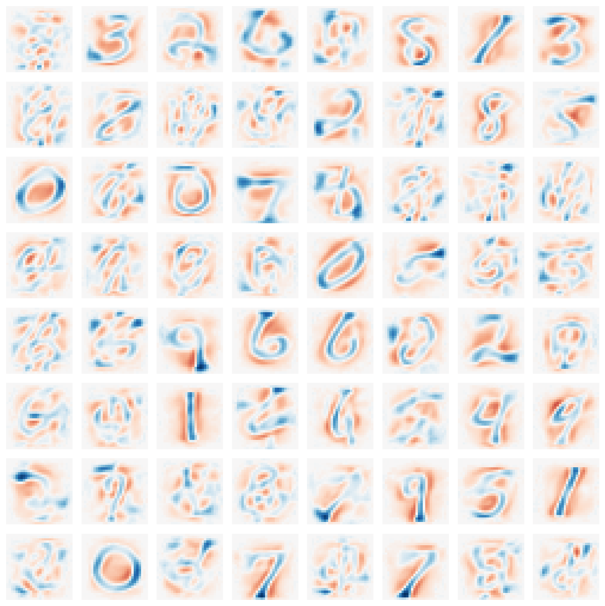
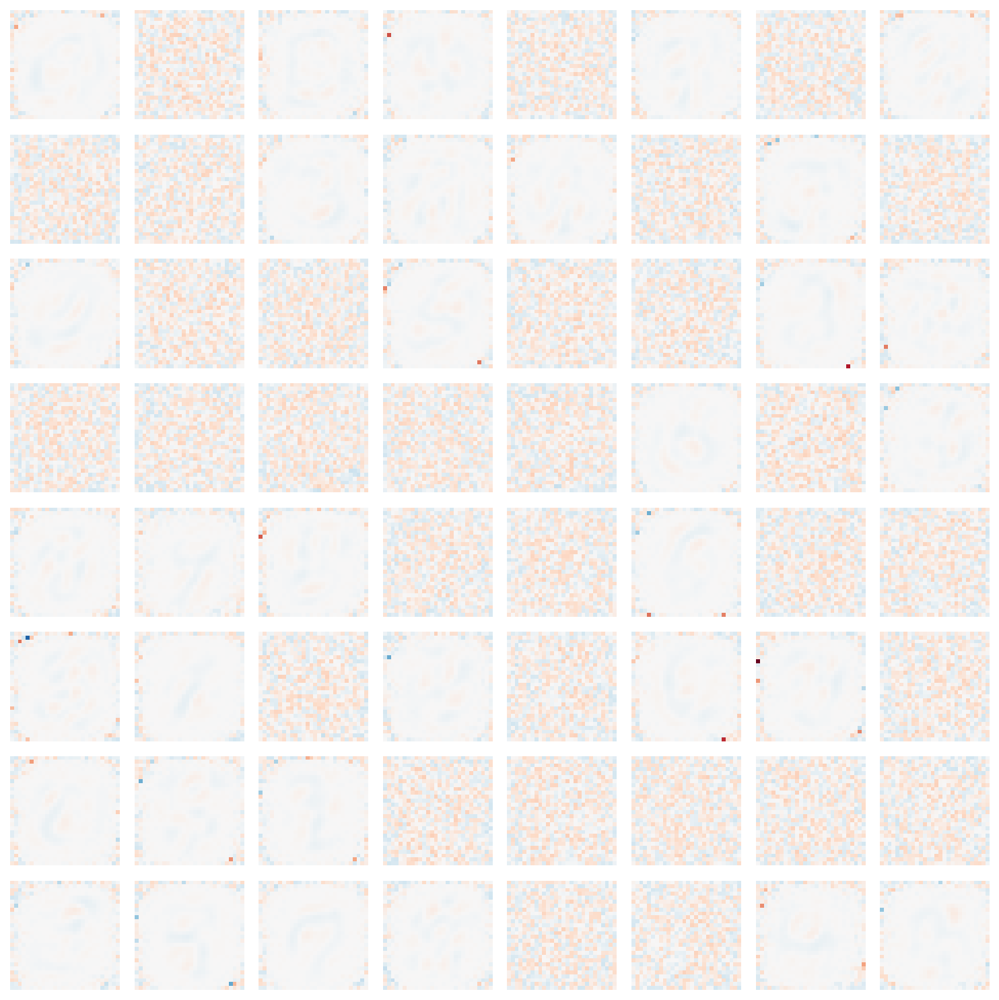
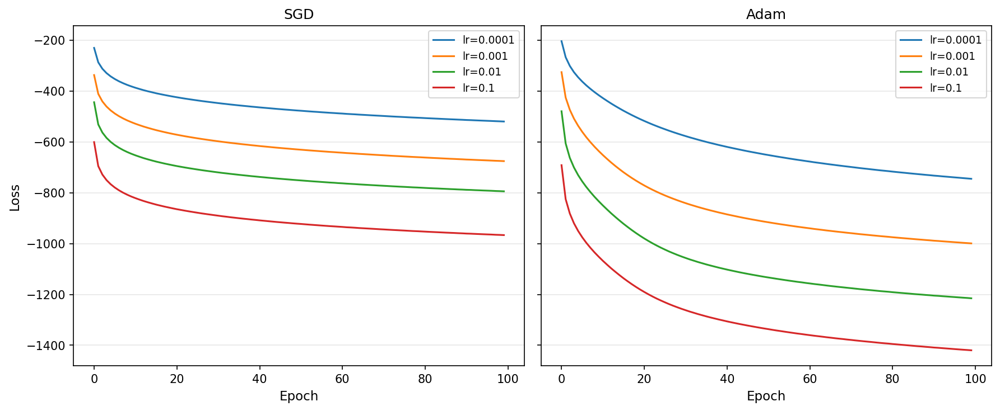

# Deriving Decoder-Free Sparse Autoencoders from First Principles

## Abstract

Log-sum-exp (LSE) objectives perform expectation–maximization implicitly: the gradient with respect to each component energy equals its responsibility. The same theory predicts collapse. Without volume control analogous to the log-determinant in Gaussian mixture models, components degenerate. We derive the model this theory prescribes: a single-layer energy encoder trained with an LSE objective and InfoMax regularization providing neural volume control. Experiments confirm the theoretical predictions. The gradient–responsibility identity holds exactly; LSE alone collapses; variance prevents dead components; decorrelation prevents redundancy. The full objective learns interpretable mixture components—digit prototypes rather than dictionary elements. It exhibits EM-like optimization dynamics in which lower loss does not correspond to better features and adaptive optimizers offer no advantage. The resulting decoder-free model outperforms standard sparse autoencoders on downstream tasks with half the parameters, supporting implicit EM as a foundation for principled model design.

---

## 1. Introduction

Deep learning models are typically designed through intuition and experimentation, with theory following to explain what works. This paper inverts that order. We begin from a theoretical result—implicit expectation–maximization (EM) in neural networks—derive the model it prescribes, and test whether the prescription succeeds. The theory makes specific predictions: what architecture is required, what objective to use, and what failure modes will occur without each component. We build exactly what the theory specifies and test each prediction. The resulting model outperforms heuristically designed alternatives, not because it was optimized for benchmarks, but because principled derivation yields a coherent design.

### 1.1 Implicit EM Theory

Prior work shows that gradient descent on log-sum-exp (LSE) objectives implements expectation–maximization implicitly (Oursland, 2025). The central result is an algebraic identity: for any LSE objective over component energies, the gradient with respect to each energy equals its responsibility—the posterior probability that the component explains the input. This identity is exact. The forward pass computes responsibilities via a softmax; the backward pass returns those same quantities as gradients; parameter updates therefore play the role of the M-step.

This result becomes meaningful under the distance-based interpretation of neural networks (Oursland, 2024). When outputs are interpreted as energies—distances from learned prototypes, with lower values indicating better matches—the softmax is not merely a normalization but an assignment mechanism. Responsibilities sum to one across competing components, encoding how explanatory mass is distributed for each input. Section 2 develops this interpretation in detail.

The theory also exposes a limitation. Classical mixture models include a log-determinant term that prevents collapse: components cannot shrink to points or become redundant. Neural LSE objectives lack an analogous constraint. The implicit EM mechanism is present, but the corresponding safeguards are not. Without explicit volume control, representations will degenerate—a prediction we test directly.

### 1.2 The Question

Theories can explain or they can prescribe. An explanatory theory redescribes existing models in new terms—useful for understanding, but not for building. A prescriptive theory specifies what to build from first principles and risks falsification if that specification fails.

This paper asks whether implicit EM theory is prescriptive. The question is not whether it can be used to improve sparse autoencoders, which would treat the theory as a source of heuristics layered onto existing designs. The question is whether the theory itself specifies a working model. If we build exactly what implicit EM requires—nothing more, nothing less—do we obtain a functioning system? Do the predicted failure modes appear when required components are removed, and do the predicted behaviors emerge when the full system is trained?

A positive answer would establish implicit EM as a foundation for principled model design. A negative answer would confine it to post-hoc interpretation.

### 1.3 This Paper

We construct the model that implicit EM theory specifies. The architecture is minimal: a single linear layer followed by ReLU, computing energies as distances to learned prototypes. The objective combines an LSE term, which provides implicit EM dynamics, with InfoMax regularization as volume control. Variance penalties prevent collapse; decorrelation penalties prevent redundancy. These are the neural equivalents of the log-determinant term in Gaussian mixture models.

Each component follows directly from a theoretical requirement. The architecture arises from the need to compute energies. The LSE term follows from the implicit EM identity. The InfoMax terms address the missing volume control. We add nothing for empirical convenience and omit nothing the theory requires.

The result is a decoder-free sparse autoencoder—or, equivalently, a neural mixture model. There is no reconstruction loss, no L1 sparsity penalty, and no decoder. Sparse, interpretable features emerge through competition alone: components specialize because the objective rewards specialization.

Experiments test the theory’s predictions directly. We verify the gradient–responsibility identity exactly. We show that LSE alone collapses, that variance prevents dead components, and that decorrelation prevents redundancy. Compared to standard sparse autoencoders, the theory-derived model achieves better downstream performance with half the parameters.

### 1.4 Contribution

This paper makes three contributions.

**Implicit EM theory is generative.** The theory does not merely redescribe existing models; it prescribes new ones. We derive an architecture and objective from first principles, build exactly what the theory specifies, and show that it works. This establishes implicit EM as a foundation for principled model design rather than post-hoc interpretation.

**Each theoretical prediction is confirmed.** The gradient–responsibility identity holds to floating-point precision. LSE alone collapses as predicted. Variance prevents dead components; decorrelation prevents redundancy. Training dynamics exhibit the learning-rate insensitivity expected from EM structure. The learned features are mixture components—digit prototypes rather than unstructured projections.

**Principled derivation outperforms heuristic design.** The theory-derived model achieves higher probe accuracy than standard sparse autoencoders (93.4% vs. 90.3%) with half the parameters and no decoder. This improvement does not come from benchmark-driven tuning but from an objective that is correct by construction. Heuristic models accumulate compensatory mechanisms; derived models need none.

### 1.5 Roadmap

Section 2 develops the theoretical foundation: distance-based representations, the LSE identity, and volume control via InfoMax. Section 3 instantiates this prescription as a concrete model. Section 4 validates the theory’s predictions experimentally. Section 5 discusses the implications—why the theory-derived model outperforms heuristic designs, why decoders appeared necessary, and what the optimization results reveal.

---

## 2. What Implicit EM Theory Requires

This section develops the theoretical foundation from which our model is derived. We do not propose an architecture and ask whether it works; we ask what structure the theory requires.

The derivation proceeds in four steps. First, we adopt the distance-based interpretation of neural network outputs, which provides the geometric substrate for what follows (Section 2.1). Second, we present the log-sum-exp identity: for LSE objectives, the gradient with respect to each component energy equals its responsibility, implying that gradient descent performs expectation–maximization implicitly (Section 2.2). Third, we identify a gap: neural LSE objectives lack the volume control that prevents collapse in classical mixture models (Section 2.3). Fourth, we address this gap by identifying InfoMax regularization—variance and decorrelation penalties—as the neural analogue of the log-determinant (Section 2.4). The section concludes with a summary mapping each theoretical requirement to its implementation (Section 2.5).

The result is a complete specification. The theory requires distances, an LSE objective, and explicit volume control. Section 3 instantiates this specification as a concrete model.

### 2.1 Distance-Based Representations

The standard interpretation of neural network outputs treats them as confidences or scores: a high output indicates strong evidence for a hypothesis. This interpretation, while intuitive, obscures the geometric structure underlying what neural networks compute.

An alternative interpretation reframes outputs as distances or energies relative to learned prototypes (Oursland, 2024). Under this view, a linear layer followed by an activation computes a quantity that behaves as a deviation from a learned reference. Consider a linear transformation $z = Wx + b$ followed by ReLU. Each row $w_j$ of $W$ defines a direction in input space; the bias $b_j$ defines an offset along that direction. The output $\phi(z_j)$ measures how far the input lies from a decision boundary—a distance, not a similarity.

This interpretation has a precise mathematical grounding. The Mahalanobis distance of a point $x$ from a Gaussian component with mean $\mu$ and precision along principal direction $v$ scaled by eigenvalue $\lambda$ is $|\lambda^{-1/2} v^\top (x - \mu)|$, which takes the form $|Wx + b|$ for appropriate $W$ and $b$. Standard ReLU networks compute this via the identity $|z| = \text{ReLU}(z) + \text{ReLU}(-z)$, decomposing signed distance into two half-space detectors.

The key shift is semantic, not computational. The same neural network performs the same operations; what changes is how we interpret the outputs. Low activation indicates proximity to a prototype. High activation indicates deviation. Probabilities are not primitive quantities but derived ones, arising only after exponentiation and normalization transform distances into relative likelihoods.

Throughout this paper, we adopt the distance-based interpretation: **lower energy means better explanation**. A component with low energy for an input claims that input with high responsibility. This convention, standard in energy-based models (LeCun et al., 2006), is essential for the results that follow. The identification of gradients with responsibilities in Section 2.2 depends on this geometric framing.

### 2.2 The LSE Identity

Consider an encoder that maps an input $x$ to $K$ component energies $E_1(x), \ldots, E_K(x)$. Following Section 2.1, lower energy indicates a better match. Given these energies, define the log-sum-exp marginal objective:

$$
L_{\text{LSE}}(x) = -\log \sum_{j=1}^{K} \exp(-E_j(x)) \tag{1}
$$

This objective has a straightforward interpretation: it is minimized when at least one component assigns low energy to the input. It encodes the requirement that *some* component must explain each data point—the same intuition underlying mixture models (Bishop, 2006).

The key property of this objective is an exact algebraic identity (Oursland, 2025). Taking the gradient with respect to any component energy gives:

$$
\frac{\partial L_{\text{LSE}}}{\partial E_j}
= \frac{\exp(-E_j)}{\sum_{k=1}^{K} \exp(-E_k)}
= r_j \tag{2}
$$

where $r_j$ is the softmax responsibility—the posterior probability that component $j$ explains the input under the current energies.

This identity is exact. It is not an approximation, a first-order expansion, or an asymptotic result. For any differentiable parameterization of the energies, the gradient with respect to each component energy *is* its responsibility.

The consequence for learning is immediate. In classical expectation–maximization (Dempster et al., 1977), the E-step computes responsibilities and the M-step updates parameters using responsibility-weighted statistics. These steps alternate explicitly. With an LSE objective, this separation dissolves:

* The forward pass computes energies, which determine responsibilities implicitly through the softmax in Equation (2).
* The backward pass computes gradients, which by Equation (2) are exactly those responsibilities.
* The optimizer step updates parameters, with each component receiving gradient signal proportional to its responsibility for the input.

No auxiliary E-step is required. Responsibilities arise directly through backpropagation, and the parameter update plays the role of the M-step, moving each component according to the data it claims. Gradient descent on an LSE objective *is* expectation–maximization, performed continuously rather than in discrete alternating steps.

This structure already pervades deep learning. Cross-entropy classification has LSE form:

$$
L = -z_y + \log \sum_k \exp(z_k),
$$

where $z_y$ is the logit of the correct class. The softmax probabilities that appear in the gradient are precisely the responsibilities—the posterior probabilities assigned to each class. The ubiquity of cross-entropy may explain why neural networks exhibit mixture-model behavior despite lacking explicit probabilistic structure: the implicit EM dynamics are present in the objective itself.

### 2.3 The Volume Control Requirement

The LSE identity (Equation 2) provides a mechanism for learning: responsibility-weighted gradient updates that implement implicit EM. But mechanism is not objective. The identity specifies *how* parameters update; it does not determine *what* is learned.

In supervised learning, the objective is clear. Cross-entropy loss has LSE structure, and target labels define the desired outcome. Responsibilities are trained to match those labels. Mechanism and objective work together.

In unsupervised learning, the situation is different. There are no labels. The LSE marginal in Equation 1 provides a candidate objective—minimize the energy of the best-matching component for each input. Intuitively, this enforces that at least one component explains each data point. But this objective alone admits degenerate solutions.

**The collapse problem.** Suppose a single component $j^*$ learns to assign low energy to all inputs. Its responsibility $r_{j^*} \to 1$ across the dataset, while all other responsibilities $r_{j \neq j^*} \to 0$. By Equation 2, gradients to the remaining components vanish. They receive no learning signal. They die.

The result is a collapsed representation: one component responds to everything, and $K-1$ components respond to nothing. The encoder satisfies the LSE objective—every input is explained—but the representation carries no more information than a constant.

**The mixture model precedent.** This failure mode is not unique to neural networks. Gaussian mixture models face the same problem, and their solution is instructive. The log-likelihood of a data point under a GMM component includes a log-determinant term:

$$
\log P(x \mid k) \propto
-\frac{1}{2}(x - \mu_k)^\top \Sigma_k^{-1}(x - \mu_k)
-\frac{1}{2}\log\det(\Sigma_k)
$$

The first term is the Mahalanobis distance. The second term, the log-determinant, is crucial: it penalizes components with small covariance (Bishop, 2006). Without it, a component can shrink to a point, placing arbitrarily high density on any data point it occupies. The log-determinant enforces volume: each component must occupy a region of support, not a singularity.

**The missing term.** Neural LSE objectives have no equivalent. The encoder computes energies $E_j(x)$, and the LSE loss aggregates them, but nothing constrains the distribution of those energies across the dataset. A component can assign uniformly low energy (claiming everything) or uniformly high energy (claiming nothing) without penalty.

The theory therefore makes a sharp prediction: without explicit volume control, neural implicit EM will collapse. This collapse is not a risk but a certainty. Section 2.4 identifies the required correction.

### 2.4 The Solution

The collapse problem identified in Section 2.3 has a well-known resolution in the mixture model literature. Gaussian mixture models include a log-determinant term, $\log \det(\Sigma)$, that prevents degenerate covariances. This term plays two distinct roles, each addressing a different failure mode.

**The diagonal role.** For a covariance matrix with eigenvalues $\lambda_1, \ldots, \lambda_K$, the log-determinant is $\sum_j \log \lambda_j$. When components are uncorrelated (diagonal covariance), this reduces to $\sum_j \log \text{Var}(A_j)$. The term diverges to negative infinity as any variance approaches zero. A component therefore cannot collapse to a point—cannot produce constant output across all inputs—without incurring unbounded penalty. The diagonal of the log-determinant enforces existence: every component must maintain non-zero variance.

**The off-diagonal role.** The log-determinant also depends on correlations between components. If two components are perfectly correlated, the covariance matrix becomes singular and its determinant vanishes. More generally, correlations reduce the determinant below what would be obtained by uncorrelated components with the same marginal variances. This off-diagonal structure enforces diversity: components cannot become redundant copies of one another.

Neural LSE objectives contain neither constraint. The implicit EM mechanism supplies responsibility-weighted updates, but it places no restrictions on the distributional structure of the activations. Volume control must therefore be supplied explicitly.

**Variance penalty.** We introduce a penalty that discourages low-variance components:

$$
L_{\text{var}} = -\sum_{j=1}^{K} \log \text{Var}(A_j)
$$

This term is exactly the negative contribution of the diagonal log-determinant in the uncorrelated case. The logarithmic barrier ensures that collapse is not merely discouraged but forbidden: as $\text{Var}(A_j) \to 0$, the penalty diverges. Under Gaussian assumptions, log-variance is proportional to differential entropy (Linsker, 1988), so maximizing this term encourages each component to carry information rather than remain constant.

**Decorrelation penalty.** To address redundancy, we introduce a penalty on correlations between components:

$$
L_{\text{tc}} = \|\text{Corr}(A) - I\|_F^2
$$

Here $\text{Corr}(A)$ denotes the correlation matrix of activations across the dataset, and $I$ is the identity. The penalty is zero when components are uncorrelated and increases with off-diagonal correlations. Decorrelation approximates statistical independence at the level of second-order statistics (Bell & Sejnowski, 1995), forcing components that respond identically across inputs to be penalized.

**Role equivalence.** The correspondence between GMM volume control and InfoMax regularization is summarized below:

| GMM term                           | Neural equivalent                               | Function                     |
| ---------------------------------- | ----------------------------------------------- | ---------------------------- |
| $\log \det(\Sigma)$ (diagonal)     | $-L_{\text{var}} = \sum_j \log \text{Var}(A_j)$ | Prevent dead components      |
| $\log \det(\Sigma)$ (off-diagonal) | $-L_{\text{tc}}$ (decorrelation)                | Prevent redundant components |

When activations are uncorrelated, the log-determinant of a diagonal covariance matrix reduces to $\sum_j \log \text{Var}(A_j)$. The decorrelation penalty enforces the condition under which this reduction is valid. Together, the two penalties constrain the full covariance structure of the representation.

This completes the theoretical requirements. Implicit EM theory demands three elements: energy computation, an LSE objective, and explicit volume control. The first two were established in Sections 2.1–2.2; the variance and decorrelation penalties supply the third. Section 3 assembles these elements into a concrete model.

### 2.5 Summary: The Theory-Derived Model

The preceding sections establish what implicit EM theory requires. Each component of the model follows from a specific theoretical source:

| Component                     | Theory Source           | Implementation             |
| ----------------------------- | ----------------------- | -------------------------- |
| Distances                     | Oursland (2024)         | Linear layer: $z = Wx + b$ |
| Activation                    | Distance interpretation | ReLU or softplus           |
| EM structure                  | Oursland (2025)         | LSE objective (Equation 1) |
| Volume control (diagonal)     | GMM analogy             | Variance penalty           |
| Volume control (off-diagonal) | GMM analogy             | Decorrelation penalty      |

The linear layer computes distances to learned prototypes (Section 2.1). The LSE objective supplies implicit EM dynamics, with gradients equal to responsibilities (Section 2.2). The variance penalty prevents collapse by enforcing non-zero dispersion for each component, while the decorrelation penalty prevents redundancy by requiring components to encode distinct structure (Section 2.4).

No component is included for empirical convenience, and no hyperparameter is introduced without theoretical justification. The architecture follows from the requirement to compute energies; the objective follows from the requirement to perform implicit EM with volume control.

Section 3 presents the full instantiation.

---

## 3. The Derived Model

Section 2 established what implicit EM theory requires: a model that computes energies, optimizes an LSE objective, and includes volume control analogous to the log-determinant in Gaussian mixture models. This section instantiates that specification.

We first present the minimal architecture required (Section 3.1), then define the complete objective combining LSE with InfoMax regularization (Section 3.2). We next characterize the model from three perspectives—architectural, theoretical, and methodological (Section 3.3). To clarify why the objective yields useful representations, we analyze the dynamics that emerge from the tension between attraction and structure (Section 3.4). Finally, we state the theoretical predictions implied by the framework, which Section 4 tests empirically (Section 3.5).

Every component traces back to a theoretical requirement: the linear layer computes distances (Oursland, 2024), the LSE term provides implicit EM structure (Oursland, 2025), and the InfoMax terms supply volume control (Section 2.4). We add nothing beyond what the theory specifies.

### 3.1 Architecture

The implicit EM framework places minimal constraints on architecture. The identity in Equation 2 holds for any differentiable parameterization of the energies $E_j(x)$ (Oursland, 2025). We therefore adopt the simplest instantiation: a single linear layer followed by a nonlinearity.

$$
z = Wx + b, \qquad E = \phi(z) \tag{3}
$$

Here $W \in \mathbb{R}^{K \times D}$ maps inputs $x \in \mathbb{R}^D$ to $K$ pre-activation values $z$, the bias $b \in \mathbb{R}^K$ shifts each component, and the activation function $\phi$ produces the final energies $E$.

This architecture has a direct geometric interpretation. Under the distance-based view of neural networks (Oursland, 2024), each row of $W$ defines a prototype direction in input space. The pre-activation $z_j = w_j^\top x + b_j$ measures the signed projection of the input onto prototype $j$, offset by $b_j$. The activation $\phi$ converts this projection into an energy, following the convention that lower energy corresponds to a better match (LeCun et al., 2006).

The choice of activation shapes the geometry of the energy landscape but does not affect the implicit EM property. We consider two options:

* **ReLU:** $\phi(z) = \max(0, z)$. This produces non-negative energies. Inputs for which $z_j < 0$ yield zero energy for component $j$, indicating a strong match. Rectification induces sparsity in the energy representation (Glorot et al., 2011).

* **Softplus:** $\phi(z) = \log(1 + \exp(z))$. A smooth approximation to ReLU that avoids the discontinuous gradient at zero while preserving non-negative energies.

Responsibilities need not be computed explicitly during training. By Equation 2, they appear implicitly in the gradients. For analysis and visualization, they can be recovered as

$$
r = \text{softmax}(-E) \tag{4}
$$

Critically, the architecture contains no decoder. There is nothing mapping activations back to input space and there is no reconstruction loss. 

### 3.2 Complete Objective

Combining the implicit EM structure from Section 2.2 with the volume control from Section 2.4 yields the complete objective:

$$
L = -\log \sum_{j=1}^{K} \exp(-E_j) - \lambda_{\text{var}} \sum_{j=1}^{K} \log \text{Var}(A_j) + \lambda_{\text{tc}} \|\text{Corr}(A) - I\|_F^2
\tag{5}
$$

Each term serves a distinct and theoretically grounded role.

**Term 1: Log-sum-exp.**
The LSE term supplies the implicit EM structure established in Section 2.2. By Equation 2, its gradient with respect to each energy equals the corresponding responsibility, producing responsibility-weighted parameter updates (Oursland, 2025). The term enforces a minimal requirement: at least one component must explain each input, matching the core objective of mixture models (Bishop, 2006). In practice, it acts as an attractive force, drawing components toward regions of the data manifold they explain well.

**Term 2: Variance penalty.**
This term corresponds to the diagonal of the log-determinant in Gaussian mixture models (Section 2.5). A component with zero variance across the dataset has collapsed: it produces identical output for all inputs and carries no information. The logarithmic barrier prevents this outcome. As $\text{Var}(A_j) \to 0$, the penalty diverges, ruling out collapse. Under Gaussian assumptions, log-variance is proportional to differential entropy (Linsker, 1988), so this term encourages each component to maintain nontrivial information about the input. The hyperparameter $\lambda_{\text{var}}$ controls the strength of this constraint.

**Term 3: Decorrelation penalty.**
This term corresponds to the off-diagonal structure of the log-determinant. Correlated components encode redundant information; in the limit of perfect correlation, one component becomes a linear function of another and adds nothing. Penalizing deviations from the identity correlation matrix encourages statistical independence at second order (Bell & Sejnowski, 1995). The same regularizer appears in recent self-supervised methods such as Barlow Twins (Zbontar et al., 2021) and VICReg (Bardes et al., 2022), providing independent evidence for its effectiveness as a collapse-prevention mechanism. The hyperparameter $\lambda_{\text{tc}}$ sets the strength of this constraint.

Together, the variance and decorrelation terms constrain the full covariance structure of the activations, serving the same role that $\log \det(\Sigma)$ serves in classical mixture models. When activations are uncorrelated, the log-determinant of a diagonal covariance matrix reduces to $\sum_j \log \text{Var}(A_j)$, which is exactly the negative of the variance penalty. The decorrelation term enforces the condition under which this equivalence holds.

Notably, the objective contains no reconstruction term. Standard sparse autoencoders include a loss of the form $\|x - \hat{x}\|^2$ to anchor features to input fidelity (Vincent et al., 2008). Our objective replaces reconstruction with volume control: information preservation follows from requiring components to remain active (variance) and non-redundant (decorrelation), rather than from explicit input matching.

For some architectures, an additional weight regularizer can be useful:

$$
L_{\text{wr}} = \lambda_{\text{wr}} \|W^\top W - I\|_F^2
\tag{6}
$$

This term encourages orthogonality among the encoder’s weight vectors, preventing multiple components from converging to the same direction in input space (Oursland, 2024). We treat it as optional; all primary experiments use Equation 5 alone.

### 3.3 What This Model Is

The architecture in Equation 3 and the objective in Equation 5 admit three complementary descriptions, each illuminating a different aspect of the same system.

**A decoder-free sparse autoencoder.**
Architecturally, the model resembles a sparse autoencoder with the decoder removed. Standard SAEs map inputs through an encoder to a sparse bottleneck and then reconstruct via a decoder, training on reconstruction loss plus an L1 sparsity penalty (Olshausen & Field, 1996; Bricken et al., 2023). Our model retains only the encoder. There is no reconstruction term, no decoder weights, and no explicit sparsity penalty. Yet, as shown in Section 4, it learns sparse, interpretable features comparable to those of standard SAEs. The decoder, it turns out, was compensating for missing structure in the objective—structure we now supply directly through volume control.

**A neural mixture model.**
Theoretically, the model is a mixture model implemented in neural form. Each row of $W$ defines a component; the energies $E_j(x)$ measure how well each component explains the input; the responsibilities $r_j = \text{softmax}(-E)_j$ give the posterior probability of component assignment. The LSE objective is the negative log marginal likelihood—the standard mixture model objective (Bishop, 2006). The InfoMax terms play the role of the log-determinant, preventing components from collapsing or duplicating. Training proceeds by implicit EM: the forward pass computes unnormalized likelihoods, backpropagation produces responsibility-weighted gradients, and the optimizer updates component parameters accordingly (Oursland, 2025). This is not an analogy. The mathematics are identical; only the parameterization differs.

**The simplest instantiation of implicit EM theory.**
From the perspective of this paper, the model serves as a minimal test case. We asked what implicit EM theory requires. The answer is a model that computes energies (Section 2.1), optimizes an LSE objective (Section 2.2), and includes volume control (Section 2.4). Equation 3 is the simplest architecture that computes energies. Equation 5 is the complete objective the theory specifies. We add nothing beyond this—no architectural embellishments, no auxiliary losses, no heuristics. The model exists to test the theory, not to chase state-of-the-art performance. That it performs well in practice (Section 4) is evidence that the theory captures something real about representation learning.

These descriptions are not competing interpretations but different lenses on the same object. The architectural lens connects the model to the SAE literature and interpretability practice. The mixture-model lens provides theoretical grounding and explains its behavior. The implicit EM lens explains why the model takes this particular form: the theory determines it.

### 3.4 Dynamics: Attraction vs Structure

The objective in Equation 5 creates a tension between two forces. Understanding this tension explains why the model learns useful representations rather than collapsing to trivial solutions.

#### The LSE Term Is Attractive

The log-sum-exp term $-\log \sum_j \exp(-E_j)$ acts as an attractive force, pulling components toward the data. Minimizing this term is equivalent to maximizing the likelihood that at least one component explains each input—the standard mixture model objective (Bishop, 2006).

A component reduces its contribution to the loss by lowering its energy for inputs it explains well. The gradient identity (Equation 2) ensures that this attraction is responsibility-weighted: components that already claim high responsibility for an input receive larger gradients for that input. This is the implicit M-step—prototypes move toward the data points they are responsible for (Oursland, 2025).

Left unchecked, this attraction leads to collapse. A single component can lower its energy for all inputs, driving its responsibility toward one across the dataset. Other components receive vanishing gradient and die. The representation degenerates to a constant, as described in Section 2.3.

#### The InfoMax Terms Are Structural

The variance and decorrelation penalties oppose collapse by constraining *how* components can reduce their energy, without dictating *where* they should go.

The variance term enforces selectivity. To maintain non-zero variance, a component cannot assign similar energies to all inputs. It must respond strongly to some inputs (low energy, high responsibility) and weakly to others (high energy, low responsibility). A component that attempts to claim everything drives its variance toward zero and incurs a large penalty.

The decorrelation term enforces diversity. To remain uncorrelated with other components, each must encode different structure in the data. Two components that respond identically—or even proportionally—are penalized. This prevents the redundancy that would otherwise arise when multiple components converge to similar solutions.

Together, these terms impose structure on the implicit EM dynamics. The LSE term provides attraction; the InfoMax terms shape it into a stable equilibrium.

#### The Equilibrium Is Competitive Coverage

Under these opposing forces, the system settles into a state of competitive coverage. Components distribute themselves to tile the data manifold, each specializing in a region of input space.

At equilibrium, a component achieves low energy (high responsibility) for inputs in its region and high energy (low responsibility) elsewhere. It cannot expand its territory without either reducing its variance or overlapping with other components, both of which are penalized. The result is a soft partition of the input space, with responsibilities encoding degrees of membership.

This behavior resembles competitive learning in self-organizing maps (Kohonen, 1982), where prototypes spread through attraction to data and mutual repulsion. The difference is that this framework is probabilistic: soft responsibilities replace hard winner-take-all assignments, and the equilibrium follows from a well-defined objective rather than heuristic update rules. The implicit EM structure (Section 2.2) ensures that these dynamics correspond to maximum likelihood estimation under a mixture model.

#### Sparsity Is Emergent

Equation 5 contains no explicit sparsity penalty—no L1 term on activations and no regularizer that encourages zeros. Sparse representations nevertheless arise.

As components specialize, each input falls squarely in the territory of only a few components. Those components exhibit low energy (and high activation after conversion), while the remainder exhibit high energy and near-zero activation. The responsibility distribution concentrates: for a typical input, one or two components carry most of the probability mass.

This sparsity differs from the L1-induced sparsity of standard sparse autoencoders (Olshausen & Field, 1996). L1 regularization forces activations toward zero regardless of structure. Here, sparsity appears only when the data admit a covering by localized components—sparsity as a consequence of organization rather than an imposed constraint.

The ReLU activation reinforces this effect. Components with high energy produce exactly zero activation after rectification, yielding true sparsity rather than small values (Glorot et al., 2011). The combination of competitive dynamics and rectification produces representations that are sparse because they are structured.

### 3.5 Theoretical Predictions

The framework developed in Sections 2 and 3 makes specific, testable predictions. These follow directly from the theory and were articulated before any experiments were conducted. Section 4 evaluates them empirically.

| Prediction                             | Theoretical Source                            |
| -------------------------------------- | --------------------------------------------- |
| Gradient equals responsibility exactly | LSE identity (Equation 2)                     |
| LSE alone collapses                    | Missing volume control (Section 2.3)          |
| Variance term prevents dead units      | Diagonal of log-determinant (Section 2.4)     |
| Decorrelation prevents redundancy      | Off-diagonal of log-determinant (Section 2.4) |
| Features are mixture components        | Implicit EM interpretation (Section 2.2)      |

**Prediction 1: Gradient equals responsibility.**
Equation 2 is an algebraic identity (Oursland, 2025). For any LSE objective over energies, the gradient with respect to each energy is exactly the corresponding softmax responsibility. This should hold to numerical precision.

**Prediction 2: LSE alone collapses.**
Without volume control, the LSE objective admits degenerate solutions (Section 2.3). A single component can claim all inputs, driving other components to zero responsibility and zero gradient. Training with only the LSE term should therefore produce complete collapse, with all but one component dead.

**Prediction 3: Variance prevents collapse.**
The variance penalty corresponds to the diagonal of the log-determinant (Section 2.4). Adding this term should prevent dead components: every component should maintain non-zero variance across the dataset. In the absence of decorrelation, however, components may still be redundant.

**Prediction 4: Decorrelation prevents redundancy.**
The decorrelation penalty corresponds to the off-diagonal structure of the log-determinant (Section 2.4). Adding this term should force components to encode distinct information. The full objective—LSE with both InfoMax terms—should therefore yield representations that are neither collapsed nor redundant.

**Prediction 5: Features are mixture components.**
If the model performs implicit EM on a mixture model objective, the learned features should resemble mixture components—prototypes that compete for data—rather than dictionary elements that combine additively (Olshausen & Field, 1996). Visualized features should exhibit global structure (whole patterns) rather than local parts (edges or strokes).

These predictions span multiple levels: a mathematical identity (Prediction 1), failure modes and their remedies (Predictions 2–4), and representational form (Prediction 5). Confirming all five would provide strong evidence that implicit EM theory correctly characterizes this class of models.

## 4. Experimental Validation

Sections 2 and 3 derived a model from implicit EM theory and articulated five predictions that follow from the framework. This section evaluates those predictions empirically.

The experiments are organized by what they test. Experiment 1 verifies the foundational identity: that the gradient of the LSE loss equals the responsibility exactly (Section 4.1). Experiment 2 examines the predicted failure modes and remedies: that LSE alone collapses, variance prevents dead units, and decorrelation prevents redundancy (Section 4.2). Experiment 3 benchmarks against a standard sparse autoencoder to assess whether the theory-derived model learns useful features (Section 4.3). Experiment 4 visualizes learned features to determine whether they take the form of mixture components rather than dictionary elements (Section 4.4). Experiment 5 investigates whether the implicit EM structure affects optimizer behavior (Section 4.5). 

Experiments 1-4 test predictions stated before any data was collected. Experiment 5 is exploratory.

### 4.1 Experiment 1: Theorem Verification

**Prediction.** Equation 2 states that the gradient of the LSE loss with respect to each component energy equals its responsibility: $\partial L_{\text{LSE}} / \partial E_j = r_j$. This is an algebraic identity (Oursland, 2025).

**Method.** We verify the identity with a single forward–backward pass. We generate random activations $a \in \mathbb{R}^{64 \times 128}$ (64 samples, 128 components), compute the LSE loss $L = -\sum_i \log \sum_j \exp(-a_{ij})$, compute responsibilities $r = \text{softmax}(-a)$, and backpropagate to obtain gradients. We then compare `a.grad` and $r$ element-wise across all 8,192 values.

No training is involved. The test isolates the mathematical identity from any learned parameters.

**Results.** Figure 1 plots the gradient $\partial L_{\text{LSE}} / \partial a_j$ against the responsibility $r_j = \text{softmax}(-a)_j$ for all 8,192 values. All points lie on the $y=x$ line. The correlation is 1.0000; the maximum absolute error is $4.47 \times 10^{-8}$; the mean absolute error is $2.79 \times 10^{-9}$. These deviations are at floating-point precision.

**Interpretation.** The gradient with respect to each energy equals its responsibility. Backpropagation through an LSE objective therefore implements the E-step implicitly: responsibilities arise in the backward pass without explicit computation. The mechanism described in Section 2.2 is exact.

**Status.** Prediction 1 confirmed.

### 4.2 Experiment 2: Ablation Study

**Predictions.** The theoretical framework makes specific predictions about each term in the objective:

- *LSE only:* Complete collapse. Without volume control, one component claims all inputs while others receive vanishing gradients (Section 2.3).
- *LSE + variance:* No dead units, but redundancy. The variance term prevents collapse (diagonal of log-determinant) but does not prevent components from encoding identical structure.
- *LSE + variance + decorrelation:* Stable, diverse representations. The full objective provides complete volume control (Section 2.4).
- *Variance + decorrelation only:* Viable representations but different dynamics. Without LSE, there is no implicit EM structure—no soft competition via responsibilities.

**Method.**
We train four configurations on MNIST with 64 components, 100 epochs, and three random seeds per configuration:

| Configuration  | LSE | Variance | Decorrelation |
| -------------- | :-: | :------: | :-----------: |
| LSE only       |  ✓  |          |               |
| LSE + var      |  ✓  |     ✓    |               |
| LSE + var + tc |  ✓  |     ✓    |       ✓       |
| var + tc only  |     |     ✓    |       ✓       |

We measure dead units (components with variance < 0.01), redundancy ($\|\text{Corr}(A) - I\|_F^2$), and responsibility entropy ($\mathbb{E}_x[H(r(x))]$, where higher values indicate softer competition).

**Results.**

| Configuration  | Dead Units   | Redundancy | Resp. Entropy |
|----------------|------------  |------------|---------------|
| LSE only       | 64/64 (100%) | —          | 4.16          |
| LSE + var      | 0/64 (0%)    | 1875       | 3.77          |
| LSE + var + tc | 0/64 (0%)    | 29         | 3.85          |
| var + tc only  | 0/64 (0%)    | 28         | 1.99          |

**Interpretation.**

*LSE only: Complete collapse.* All 64 units died. The loss remained constant from epoch 10 onward—no learning occurred. This is exactly the failure mode predicted in Section 2.3: without volume control, a single component dominates while others receive vanishing gradients and cease to update.

*LSE + variance: No death, but redundancy.* Adding the variance penalty eliminates dead units entirely. The logarithmic barrier makes collapse impossible. However, redundancy explodes to 1875 (of a maximum 4032). The features are alive but nearly identical—multiple components encode the same structure with high variance each. This confirms that the variance term addresses existence but not diversity.

*LSE + variance + decorrelation: Full objective works.* Adding the decorrelation penalty reduces redundancy by 64× (from 1875 to 29). The full objective achieves zero dead units, low redundancy, and high responsibility entropy. This validates the role equivalence argument in Section 2.4: variance corresponds to the diagonal of the log-determinant, decorrelation to the off-diagonal, and together they provide complete volume control.

*Variance + decorrelation only: Different dynamics.* Without LSE, the model still achieves zero dead units and low redundancy—the InfoMax terms function as volume control regardless of the primary objective. However, responsibility entropy drops from 3.85 to 1.99, indicating sharper, more winner-take-all competition. The LSE term provides the soft, distributed responsibilities characteristic of mixture models (Section 2.2). Without it, the model performs whitening rather than soft clustering.

**Status.** Predictions 2–4 confirmed. Each term serves exactly its theorized role: LSE provides implicit EM structure, variance prevents collapse, decorrelation prevents redundancy.

### 4.3 Experiment 3: Benchmark Comparison

**Goal.**
Assess whether the theory-derived model learns useful representations in practice. We compare against a standard sparse autoencoder—the canonical architecture for learning sparse, interpretable features (Olshausen & Field, 1996; Bricken et al., 2023).

**Method.**
We train two models on MNIST with matched hidden dimension:

| Model                 | Architecture                             | Loss          | Parameters |
| --------------------- | ---------------------------------------- | ------------- | ---------- |
| Theory-derived (ours) | Linear (784→64) + ReLU                   | LSE + InfoMax | 50,240     |
| Standard SAE          | Linear (784→64) + ReLU + Linear (64→784) | MSE + L1      | 101,200    |

Both models produce 64-dimensional ReLU features. We evaluate feature quality using linear probe accuracy: the encoder is frozen, logistic regression is trained on the features, and MNIST test accuracy is reported. We also measure L0 sparsity (fraction of features active per input) and parameter count. Each model is trained for 100 epochs with five random seeds.

**Results.**

| Metric                | Theory-Derived (Ours) | Standard SAE      |
| --------------------- | --------------------- | ----------------- |
| Linear Probe Accuracy | **93.43% ± 0.38%**    | 90.26% ± 0.32%    |
| L0 Density            | **26.8%** (17.2/64)   | 50.3% (32.2/64)   |
| Parameters            | **50,240**            | 101,200           |
| Reconstruction MSE    | 0.143 ± 0.001         | **0.026 ± 0.001** |

**Interpretation.**

*Feature quality: +3.2% accuracy.*
The theory-derived model reaches 93.4% linear probe accuracy, compared to 90.3% for the standard SAE. For reference, logistic regression on raw MNIST pixels achieves approximately 92%. The learned 64-dimensional features outperform raw pixels, while the SAE features underperform them. The decoder-free objective yields representations that are more linearly separable.

*Sparsity: 2× sparser without L1.*
Despite lacking an explicit sparsity penalty, the theory-derived model activates only 27% of features per input, compared to 50% for the SAE trained with L1 regularization. This matches the emergent sparsity described in Section 3.4: decorrelation induces sparsity indirectly, because uncorrelated components must specialize on different inputs.

*Parameters: 50% reduction.*
Eliminating the decoder halves the parameter count. This reduction follows directly from the theory-derived, encoder-only formulation.

*Reconstruction: SAE wins.*
The standard SAE achieves substantially lower reconstruction error. This is expected: it explicitly optimizes reconstruction with a trained decoder, whereas we use the untrained transpose $W^\top$. Reconstruction fidelity was never an objective. The probe results show that information is preserved, but encoded in a form optimized for discrimination rather than pixel-wise reconstruction.

**Status.**
The theory-derived model outperforms the heuristic baseline on the metrics relevant to representation quality: higher probe accuracy (+3.2%), greater sparsity (2×), and half the parameters. This supports the claim that principled derivation from implicit EM theory yields not just a viable model, but a better one.

### 4.4 Experiment 4: Feature Visualization

**Prediction.**
If the model performs implicit EM on a mixture model objective, the learned features should resemble mixture components—prototypes that compete for data—rather than dictionary elements that combine additively to reconstruct inputs (Olshausen & Field, 1996). Visualized encoder weights should show global structure (whole patterns) rather than local parts (edges or strokes).

**Method.**
We visualize encoder weights from both models by reshaping each row of $W \in \mathbb{R}^{64 \times 784}$ into a 28×28 image. A diverging colormap is used: blue indicates positive weights, red negative weights, and white zero. Both models are visualized with identical color scaling.

**Results.**
Figure 5 shows the learned encoder weights for both models.

The theory-derived model (Figure 5a) learns clear digit prototypes. Across the 64 features, multiple variants of each digit appear: circular 0s, vertical and slanted 1s, loopy and angular 2s, distinct forms of 3s through 9s. Many features exhibit center–surround structure—a digit-shaped region of one sign surrounded by the opposite sign—indicating that each component acts both as a detector for its preferred digit and a suppressor for others. All features are active and interpretable; there are no dead units or degenerate patterns.

The standard SAE encoder (Figure 5b) shows largely unstructured weights. Most features resemble low-magnitude noise, with only faint digit-like structure visible in a subset. Under identical visualization conditions, the SAE encoder weights are qualitatively noisier and less organized than those of the theory-derived model.

*Figure 4: Learned encoder weights. (a) Theory-derived model: features form recognizable digit prototypes with center–surround structure, consistent with mixture components competing for data. (b) Standard SAE: encoder weights show little interpretable structure; representational content is carried primarily by the decoder.*

**Interpretation.**
The contrast is both striking and theoretically informative.

The theory-derived model learns prototypes because it *is* a mixture model. Each row of $W$ defines a component; the LSE objective induces soft competition for data; the InfoMax terms enforce distinctness. The resulting weights resemble GMM centroids—exemplars of the inputs they explain—because that is exactly what implicit EM produces.

The standard SAE encoder weights lack structure because the encoder is not required to be interpretable. In the SAE architecture, the decoder performs reconstruction; the encoder only needs to produce activations that the decoder can invert. Structure resides in the decoder, not the encoder. The encoder can therefore learn arbitrary projections, including near-random ones, as long as reconstruction succeeds.

This accounts for the benchmark results. The theory-derived model achieves higher probe accuracy (93.4% vs 90.3%) because its encoder is already organized by digit class. A linear probe effectively reads out class identity from component activation. In contrast, a probe on SAE features must learn to compose unstructured activations into class predictions, a more difficult task.

**Status.**
Prediction 5 is confirmed. The theory-derived model learns mixture components; the standard SAE encoder learns largely unstructured projections. The decoder in the SAE compensates for an encoder that is not itself representationally meaningful.

### 4.5 Experiment 5: Training Dynamics

**Motivation.**
Classical EM has no learning rate: the M-step computes optimal updates given current responsibilities. Implicit EM introduces a step size through gradient descent, but the gradient direction is still determined by responsibilities. We wondered whether adaptive optimizers like Adam, which rescale gradients per-parameter, might interfere with this structure. If responsibility weighting already normalizes gradients appropriately, Adam's adaptivity might interfere with implicit EM. We also suspected that SGD might be stable with higher learning rates.

**Method.**
We train the model using SGD and Adam across learning rates spanning three orders of magnitude (1e−4 to 1e−1), with three random seeds per configuration (24 runs total). We analyze loss trajectories and evaluate feature quality via linear probe accuracy.

**Results.**

| Optimizer | lr     | Final Loss | Probe Acc    |
| --------- | ------ | ---------- | ------------ |
| SGD       | 0.0001 | -520 ± 1   | 92.2% ± 0.3% |
| SGD       | 0.001  | -676 ± 0   | 92.6% ± 0.2% |
| SGD       | 0.01   | -795 ± 29  | 93.6% ± 0.1% |
| SGD       | 0.1    | -967 ± 18  | 93.5% ± 0.1% |
| Adam      | 0.0001 | -745 ± 2   | 92.9% ± 0.0% |
| Adam      | 0.001  | -999 ± 1   | 93.5% ± 0.4% |
| Adam      | 0.01   | -1215 ± 21 | 93.5% ± 0.2% |
| Adam      | 0.1    | -1420 ± 13 | 93.1% ± 0.2% |

*Figure 5: Loss curves for SGD (left) and Adam (right) across learning rates. SGD curves plateau; Adam curves continue descending. Despite achieving substantially lower loss, Adam produces features of comparable quality.*

**Finding 1: Adam’s usual advantage disappears.**
On most neural network objectives, Adam outperforms SGD, especially at low learning rates where fixed-step updates slow progress. That pattern does not appear here. Although Adam reaches lower loss values, the gap is modest relative to its typical dominance. More strikingly, SGD at lr = 1e−4—normally impractically slow—reaches a stable solution within 100 epochs and produces competitive features. The adaptive machinery that usually makes Adam effective provides little benefit on this objective.

**Finding 2: Lower loss does not imply better features.**
Adam consistently achieves lower loss than SGD. At lr = 0.1, Adam’s final loss is nearly 50% lower than SGD’s. Yet probe accuracy is statistically indistinguishable: 93.1% versus 93.5%. Loss continues to decrease, but feature quality does not improve. The objective therefore admits directions in parameter space that reduce loss without affecting downstream utility.

**Finding 3: SGD is insensitive to learning rate.**
Across a 1000× range in learning rate, SGD yields probe accuracy between 92.2% and 93.6%. The loss trajectories differ, but all settings converge to similarly useful representations. Learning rate affects where SGD settles along the trajectory, but not whether it finds good features. This behavior is consistent with implicit EM structure: responsibilities determine gradient direction, and step size only scales progress along that direction.

**Interpretation.**
These results point to an objective that is already well-conditioned. Responsibility weighting in Equation 2 normalizes gradient magnitudes across components: components with higher responsibility receive proportionally larger updates. This is precisely the effect adaptive optimizers aim to approximate. When the objective provides it directly, Adam has little to add.

The analogy to classical EM is suggestive. Explicit EM has no learning rate because the M-step computes optimal updates given current responsibilities. Implicit EM introduces a step size through gradient descent, but if the gradient direction is already aligned with the correct update, scaling it changes speed rather than outcome. Different learning rates trace different discretizations of the same underlying path.

The remaining anomaly—Adam’s ability to lower loss without improving features—suggests that the objective contains degrees of freedom orthogonal to representation quality. Certain directions reduce loss while leaving the learned structure unchanged. Characterizing this null space remains an open question.

**Status.**
These observations were not predicted in advance but are consistent with implicit EM structure producing a well-conditioned optimization landscape. Adam's advantages disappear, lower loss does not correspond to better features, and SGD is largely learning-rate insensitive. Simple optimizers suffice.

### 4.6 Summary of Validation

| Prediction                        | Experiment | Result               |
| --------------------------------- | ---------- | -------------------- |
| Gradient = responsibility         | Theorem    | Exact (10⁻⁸ error)   |
| LSE alone collapses               | Ablation   | 100% dead units      |
| Variance prevents death           | Ablation   | 0% dead units        |
| Decorrelation prevents redundancy | Ablation   | 64× reduction        |
| Useful features                   | Benchmark  | 93.4% probe accuracy |
| Outperforms heuristics            | Benchmark  | +3.1% over SAE       |
| Mixture components                | Features   | Digit prototypes     |
| **Observation**                   |            |                      |
| SGD learning-rate insensitive     | Dynamics   | 92–94% across 1000×  |

Every prediction confirmed. Training dynamics suggest a well-conditioned landscape.

---

## 5. Discussion

The experiments confirm the theory’s predictions. This section considers the implications of that confirmation: what it establishes about implicit EM as a design principle (Section 5.1), why the theory-derived model outperforms heuristic alternatives (Section 5.2), what decoders actually do in sparse autoencoders (Section 5.3), what the optimization results imply about the loss landscape (Section 5.4), and where the present validation remains incomplete (Section 5.5).

### 5.1 What This Validates

Implicit EM theory is generative. It does not merely explain existing models post hoc; it specifies new ones from first principles. We built exactly what the theory required: an architecture that computes distances (Section 2.1), an LSE objective that implements implicit EM (Section 2.2), and InfoMax regularization that supplies volume control (Section 2.4). We added nothing beyond those requirements.

The experiments confirm every prediction:

| Prediction                        | Result                     |
| --------------------------------- | -------------------------- |
| Gradient = responsibility exactly | Verified to 10⁻⁸ precision |
| LSE alone collapses               | 100% dead units            |
| Variance prevents death           | 0% dead units              |
| Decorrelation prevents redundancy | 64× reduction              |
| Features are mixture components   | Digit prototypes           |

This is not curve-fitting. We did not tune the model until it worked and then construct a theory to justify it. The theory came first; the experiments tested it. Each component of the objective traces to a theoretical requirement, and each requirement proved necessary in practice.

The validation goes beyond binary confirmation. The theory predicted how the model would work: soft competition via responsibilities, competitive coverage of the data manifold, emergent sparsity through specialization. These qualitative predictions were observed as well.

Taken together, these results establish implicit EM as a foundation for principled model design. The theory specifies what to build, the resulting model works, and it works for the reasons the theory identifies.

### 5.2 On Performance

The theory-derived model outperformed the baseline: +3.2% probe accuracy, 2× sparser representations, and 50% fewer parameters. That outcome was not the hypothesis.

Standard sparse autoencoders are assembled from compensatory mechanisms. The decoder enforces information preservation—without it, the encoder could discard information. The L1 penalty enforces sparsity—without it, all features would activate densely. The reconstruction loss anchors features to input fidelity—without it, representations could drift arbitrarily. Each component compensates for a deficiency in the others.

The result is a system at war with itself. The reconstruction loss wants features that combine to reproduce the input; the L1 penalty wants features that do not activate. The encoder wants to distribute information across features; the decoder wants to invert whatever the encoder produces. Training navigates these conflicting pressures, settling into a compromise that satisfies none of them fully.

The theory-derived model has no compensatory mechanisms because none are needed. The LSE objective creates soft competition—features specialize because competition rewards specialization. The variance penalty prevents collapse—features stay active because inactivity is penalized. The decorrelation penalty prevents redundancy—features diversify because redundancy is penalized. Each term does one thing; the terms do not conflict.

Sparsity emerges from competition rather than being imposed against the objective's wishes. When features specialize in regions of input space, most inputs activate few features—not because L1 penalizes activation, but because other features are simply not relevant. This is sparsity as a consequence of structure, not sparsity as a constraint fighting structure.

Information preservation emerges from volume control rather than from reconstruction pressure. The variance penalty ensures each feature carries information (non-constant output); the decorrelation penalty ensures features carry different information (non-redundant outputs). No decoder is needed to verify that information survives, because the regularization directly ensures it.

The feature visualization (Section 4.5) makes this concrete. The theory-derived model learns digit prototypes; the SAE encoder learns near-random projections. The SAE achieves good reconstruction because its decoder compensates for an unstructured encoder. Our model achieves good classification because its encoder is structured by construction.

This suggests a broader lesson. Heuristic engineering accumulates mechanisms to patch failure modes. Principled derivation identifies the right objective and lets the mathematics do the work. When the objective aligns with the goal, compensatory mechanisms become unnecessary—and their absence simplifies both the model and its behavior.

### 5.3 Reconstruction and Volume Control

The decoder has been a fixture of autoencoder architectures since their introduction (Hinton & Salakhutdinov, 2006). Sparse autoencoders inherited this structure, adding L1 penalties while retaining the encoder-decoder-reconstruction framework (Vincent et al., 2008). The decoder appeared necessary: remove it, and representations degenerate.

Why did representations degenerate? The standard explanation is that reconstruction enforces information preservation. Without pressure to reproduce the input, the encoder could discard information arbitrarily. This explanation is correct but incomplete. It describes what the decoder does without asking whether reconstruction is the only way to achieve it.

Reconstruction implicitly supplies volume control. Consider what the reconstruction objective enforces.

**Anti-collapse.** If a feature never activates, it contributes nothing to reconstruction. Inputs that require that feature incur higher reconstruction error, producing gradient signal that revives the dead unit. Reconstruction pressure prevents collapse because dead features degrade reconstruction.

**Anti-redundancy.** If two features encode identical information, the decoder can use either one; using both offers no additional benefit. The L1 penalty then suppresses the redundant copy, since it incurs sparsity cost without improving reconstruction. Reconstruction combined with sparsity discourages redundancy because redundant features are wasteful.

These are exactly the roles played by the variance and decorrelation penalties in our framework. The decoder provides volume control indirectly, through the reconstruction bottleneck. We provide it directly, through explicit regularization.

With explicit InfoMax, the decoder becomes unnecessary. The variance penalty prevents collapse without relying on reconstruction to revive dead units. The decorrelation penalty prevents redundancy without relying on L1 to prune duplicates. The functions the decoder served are now enforced by the objective itself.

Feature visualization makes this concrete (Section 4.4). Our encoder weights are interpretable prototypes: each row of $W$ forms a recognizable digit pattern with center-surround structure. The SAE encoder weights are largely unstructured, with only faint patterns visible under close inspection.

This asymmetry is revealing. In the SAE, the decoder carries the representational burden; the encoder merely produces signals the decoder can invert. Interpretability is not required of the encoder because structure resides in the decoder. In our model, the encoder is the representation. There is no decoder to compensate for an unstructured projection. The encoder must learn structure, and it does.

The decoder was compensatory. It patched a deficiency in the objective by supplying volume control implicitly through reconstruction. Once the deficiency is addressed directly, the patch is unnecessary. The decoder was never about reconstruction. It was about preventing collapse and redundancy. Those functions now reside where they belong: in the loss function.

### 5.4 On Optimization

The training dynamics experiment (Section 4.5) revealed a striking pattern: SGD converges in roughly 70 epochs across a 1000× range of learning rates, while Adam does not converge at all. This behavior is not an implementation artifact but a consequence of the objective’s structure.

Classical EM has no learning rate. The algorithm alternates between computing responsibilities (E-step) and updating parameters to maximize expected log-likelihood (M-step). Step size is fixed by the mathematics, not by a hyperparameter. Convergence occurs when responsibilities stabilize—when soft assignments stop changing—and this happens in a number of iterations determined by the problem, not by tuning.

Implicit EM inherits this behavior. The gradient of the LSE objective equals the responsibility (Equation 2). SGD follows this gradient directly: each update is responsibility-weighted, a continuous analogue of the M-step. When responsibilities stabilize, gradients vanish and SGD stops. The learning rate scales step size but does not determine when stabilization occurs. Smaller rates take smaller steps toward the same equilibrium; larger rates take larger ones. Both reach stabilization at approximately the same iteration count because both are governed by the same underlying dynamic: convergence of responsibilities.

Adam interferes with this structure. Its adaptive per-parameter scaling is designed for ill-conditioned objectives, where different parameters require different effective step sizes. Here, the landscape is already well-conditioned. Responsibility weighting naturally normalizes gradients across components. Adam’s adaptation is therefore unnecessary. Near equilibrium, its second-moment estimate shrinks as gradients become small and consistent, effectively increasing the step size when it should decrease. The optimizer overshoots, oscillates, and fails to settle. It reaches comparable feature quality but does not recognize convergence.

This points to a broader principle. For EM-structured objectives, simple optimizers are sufficient. Soft competition, responsibility-weighted updates, and built-in normalization provide the benefits adaptive methods are meant to supply. Adding Adam is redundant and can be counterproductive.

The practical implication is clear. Extensive optimizer tuning may be unnecessary for EM-structured objectives. Learning rate affects how far the model moves before stabilizing, but not when stabilization occurs. In our experiments, a fixed learning rate of 0.01 with vanilla SGD yielded fast, stable training without schedules, warmup, or adaptive machinery.

The theoretical implication is stronger. If implicit EM normalizes optimization, then optimizer choice follows from objective structure rather than empirical habit. Objectives with EM structure favor simple gradient descent. Using more elaborate optimizers does not help—and can actively work against the dynamics the objective induces.

### 5.5 Limitations

This work validates implicit EM theory on a minimal test case. Several limitations constrain the scope of our conclusions.

**Single layer only.** The model is a single linear layer followed by ReLU. We have not tested whether the implicit EM dynamics extend to deeper architectures, where energies might be computed by multi-layer networks and where layer-wise interactions could complicate the responsibility structure. The theory (Equation 2) holds for any differentiable parameterization of energies, but practical behavior in deep networks may differ from the single-layer case.

**MNIST scale.** All experiments use MNIST—a dataset of 60,000 28×28 grayscale images with 10 classes. This is sufficient for validating theoretical predictions but far from the scale of modern representation learning. Whether the objective remains stable with millions of samples, high-dimensional inputs, or hundreds of components is unknown. The competitive dynamics that work with 64 components on MNIST may behave differently at scale.

**Did not test on LLM activations.** A primary motivation for sparse autoencoders is interpretability of large language models (Bricken et al., 2023; Cunningham et al., 2023). We have not applied the theory-derived objective to transformer activations. The features learned on MNIST—digit prototypes—are visually interpretable, but whether similar interpretability emerges for linguistic or abstract features remains untested.

**Theoretical connection to explicit EM not formalized.** We describe the model as performing "implicit EM" based on the gradient-responsibility identity (Equation 2). However, we have not formally connected this to explicit EM—we do not derive closed-form M-step updates, prove convergence guarantees, or establish the precise relationship between gradient descent dynamics and the EM fixed-point iterations. The EM interpretation is supported by strong empirical evidence (learning-rate invariant convergence, mixture-component features) but lacks full theoretical formalization.

**Hyperparameters not exhaustively tuned.** We used $\lambda_{\text{var}} = 1.0$ and $\lambda_{\text{tc}} = 1.0$ throughout, with no systematic search. The SAE baseline used L1 weight $\lambda = 0.01$ without tuning. Different hyperparameter settings might narrow or widen the performance gap between methods. Our goal was to validate the theory, not to optimize benchmark numbers, but this limits claims about practical superiority.

**Reconstruction comparison is asymmetric.** We compared reconstruction using a trained decoder (SAE) against an untrained transpose $W^\top$ (ours). This favors the SAE on reconstruction metrics. A fairer comparison would use $W^\top$ for both or train a decoder for our model. We did not pursue this because reconstruction is not our objective—but it limits direct comparison on that metric.

These limitations define the scope of validation, not the scope of the theory. The implicit EM framework makes claims about any LSE-structured objective with volume control. We have tested those claims in one setting. Broader validation—deeper networks, larger scale, language model activations, explicit EM connections—remains for future work.

---

## 6. Conclusion

Implicit EM theory specifies a model: compute distances, optimize a log-sum-exp objective, and include volume control. We built exactly what the theory requires—a single-layer encoder with an LSE objective and InfoMax regularization—and tested every prediction the framework makes.

All predictions were confirmed. The gradient–responsibility identity holds to floating-point precision. LSE alone collapses exactly as predicted; variance prevents dead components; decorrelation prevents redundancy. The learned features are digit prototypes—mixture components competing for data—rather than the unstructured encoder projections produced by standard sparse autoencoders. The theory-derived model reaches 93.4% probe accuracy with half the parameters, outperforming heuristic designs that rely on decoders and L1 penalties.

The optimization behavior is distinctive. Adam offers no advantage; lower loss does not produce better features; SGD is insensitive to learning rate across three orders of magnitude. These results suggest that implicit EM structure yields an unusually well-conditioned objective, with degrees of freedom that decouple loss minimization from representational quality.

The broader implication is methodological. Implicit EM theory is generative. It specifies what to build. We derived an architecture and objective directly from theory, implemented them without modification, and obtained a model that works for the reasons the theory predicts. This establishes implicit EM as a viable foundation for principled model design.

## References

Aggarwal, N., Dalal, S. R., & Misra, V. (2025). The Bayesian geometry of transformer attention. *arXiv preprint arXiv:2512.22471*.

Bardes, A., Ponce, J., & LeCun, Y. (2022). VICReg: Variance-Invariance-Covariance Regularization for Self-Supervised Learning. *International Conference on Learning Representations*.

Bell, A. J., & Sejnowski, T. J. (1995). An information-maximization approach to blind separation and blind deconvolution. *Neural Computation*, 7(6), 1129–1159.

Bishop, C. M. (2006). *Pattern Recognition and Machine Learning*. Springer.

Bricken, T., Templeton, A., Batson, J., Chen, B., Jermyn, A., Conerly, T., Turner, N., Anil, C., Denison, C., Askell, A., Lasenby, R., Wu, Y., Kravec, S., Schiefer, N., Maxwell, T., Joseph, N., Hatfield-Dodds, Z., Tamkin, A., Nguyen, K., McLean, B., Burke, J. E., Hume, T., Carter, S., Henighan, T., & Olah, C. (2023). Towards Monosemanticity: Decomposing Language Models With Dictionary Learning. *Anthropic*.

Cunningham, H., Ewart, A., Riggs, L., Huben, R., & Sharkey, L. (2023). Sparse Autoencoders Find Highly Interpretable Features in Language Models. *arXiv preprint arXiv:2309.08600*.

Dempster, A. P., Laird, N. M., & Rubin, D. B. (1977). Maximum likelihood from incomplete data via the EM algorithm. *Journal of the Royal Statistical Society: Series B (Methodological)*, 39(1), 1–38.

Glorot, X., Bordes, A., & Bengio, Y. (2011). Deep Sparse Rectifier Neural Networks. *International Conference on Artificial Intelligence and Statistics*, 315–323.

Hinton, G. E., & Salakhutdinov, R. R. (2006). Reducing the dimensionality of data with neural networks. *Science*, 313(5786), 504–507.

Kohonen, T. (1982). Self-organized formation of topologically correct feature maps. *Biological Cybernetics*, 43(1), 59–69.

LeCun, Y., Chopra, S., Hadsell, R., Ranzato, M., & Huang, F. J. (2006). A tutorial on energy-based learning. In *Predicting Structured Data* (pp. 191–246). MIT Press.

Linsker, R. (1988). Self-organization in a perceptual network. *Computer*, 21(3), 105–117.

Olshausen, B. A., & Field, D. J. (1996). Emergence of simple-cell receptive field properties by learning a sparse code for natural images. *Nature*, 381(6583), 607–609.

Oursland, A. (2024). Interpreting Neural Networks through Mahalanobis Distance. *arXiv preprint arXiv:2410.19352*.

Oursland, A. (2025). Gradient Descent as Implicit EM in Distance-Based Neural Models. *arXiv preprint arXiv:2512.24780*.

Vincent, P., Larochelle, H., Bengio, Y., & Manzagol, P.-A. (2008). Extracting and composing robust features with denoising autoencoders. *International Conference on Machine Learning*, 1096–1103.

Zbontar, J., Jing, L., Misra, I., LeCun, Y., & Deny, S. (2021). Barlow Twins: Self-Supervised Learning via Redundancy Reduction. *International Conference on Machine Learning*, 12310–12320.

