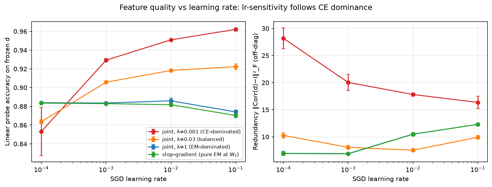
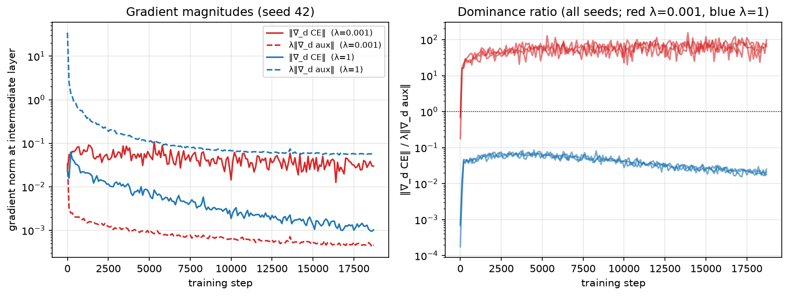
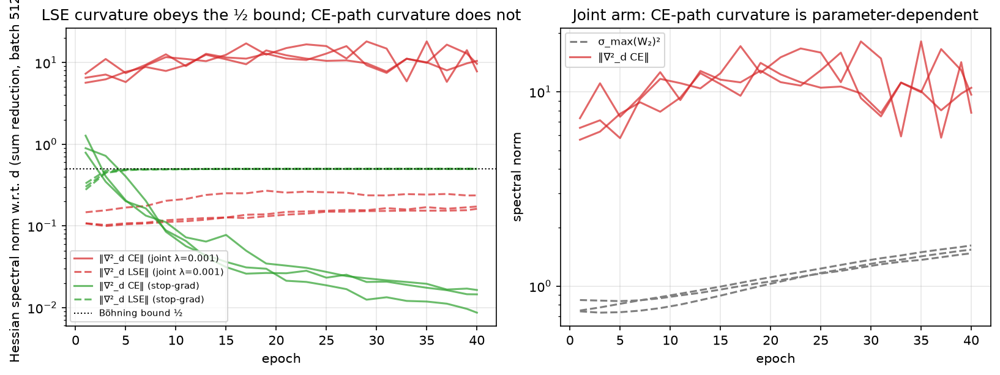

# Experiment 4: Why Composition Breaks EM Conditioning

## Context

Experiment 3 found that Paper 2's optimization anomalies — SGD learning-rate insensitivity, no Adam advantage — do not survive when the EM layer sits inside a supervised network. Its interpretation section proposed three mechanisms (W₂ᵀ scrambling, gradient magnitude interference, ReLU masking) but offered no direct evidence for any of them.

The theory notes (`notes/why_composition_breaks_em.md`, `notes/conditioning_lemma.md` at repo root) sharpen the interpretation into three falsifiable predictions:

**P1 (gradient competition).** The CE gradient reaching the intermediate layer dominates the auxiliary EM gradient at small λ; the two are near-orthogonal, so the EM signal is not opposed but drowned.

**P2 (curvature dichotomy).** The Hessian of the LSE objective w.r.t. the distances obeys the uniform Böhning bound ‖∇²_d L_LSE‖ ≤ ½ at every point of training, while the Hessian of the CE loss w.r.t. the same distances is parameter-dependent and scales with σ_max(W₂)².

**P3 (causal test).** Composition — not supervision — destroys the conditioning. If the CE gradient is prevented from reaching W₁ (stop-gradient: the head reads y.detach(), so W₁ is trained purely by the EM objective while CE trains the head), Paper 2's conditioning signatures reappear inside the supervised network.

This experiment tests all three.

## Design

Model: `x → Linear(784, 25) → ReLU → d → NegLogSoftmin → Linear(25, 10) → LayerNorm → CE`, with auxiliary loss `LSE + var + tc` applied to raw distances d (LSE is included in the auxiliary loss here, unlike experiments 1–3, so that the W₁ objective in the stop-gradient arm is exactly Paper 2's EM objective).

Four arms differ only in how the two objectives combine:

| Arm | Total loss | CE reaches W₁? | Expected regime |
|---|---|:---:|---|
| joint, λ=0.001 | CE + 0.001·aux | ✓ | CE-dominated (experiments 1–3 setting) |
| joint, λ=0.03 | CE + 0.03·aux | ✓ | balanced (predicted crossover) |
| joint, λ=1 | CE + 1.0·aux | ✓ | EM-dominated |
| stop-gradient | CE(head(y.detach())) + 1.0·aux | ✗ | pure EM at W₁ |

**Conditioning sweep:** each arm × SGD lr ∈ {0.0001, 0.001, 0.01, 0.1} × 3 seeds (42–44), MNIST, hidden dim 25, 40 epochs. Feature quality is measured by a **fixed-protocol linear probe** (Adam lr=0.001, 15 epochs) trained on frozen distances after the sweep — so feature quality is decoupled from how well the head itself trained at each sweep lr. Summary metrics average the last 5 epochs.

**Gradient competition:** during joint-arm training (Adam lr=0.001, experiment 3's operating point), every 100 steps we compute ‖∇_d CE‖ and λ‖∇_d aux‖ on the current batch, plus their cosine similarity.

**Curvature tracking:** every 2 epochs, power iteration (30 iterations, exact Hessian-vector products) estimates the spectral norm of the Hessian w.r.t. d of (a) the LSE loss and (b) the CE loss through NLS + head, on a fixed 512-sample batch with sum reduction (both Hessians are block-diagonal over samples, so this is the worst per-sample curvature). σ_max(W₂) is recorded alongside.

Code: `src/run_experiment4.py`, figures: `src/viz_experiment4.py`.

## Results

### P3: The stop-gradient causal test

Linear probe accuracy on frozen distances (mean ± std over 3 seeds):

| Arm | lr=0.0001 | lr=0.001 | lr=0.01 | lr=0.1 | spread |
|---|---|---|---|---|---|
| joint, λ=0.001 | 85.32% ± 3.13% | 92.93% ± 0.22% | 95.09% ± 0.14% | 96.21% ± 0.18% | **10.9 pts** |
| joint, λ=0.03 | 86.37% ± 0.29% | 90.57% ± 0.11% | 91.83% ± 0.16% | 92.24% ± 0.38% | **5.9 pts** |
| joint, λ=1 | 88.39% ± 0.05% | 88.35% ± 0.08% | 88.59% ± 0.35% | 87.41% ± 0.23% | **1.2 pts** |
| stop-gradient | 88.35% ± 0.06% | 88.29% ± 0.17% | 88.18% ± 0.25% | 87.03% ± 0.30% | **1.3 pts** |

The prediction holds. With the CE gradient blocked from W₁, feature quality is flat across a 1000× learning-rate range — the Paper 2 signature, reproduced inside a supervised network. With CE flowing at λ=0.001, feature quality spans 10.9 points across the same range.

Convergence *time* invariance (Paper 2's other signature) also reappears. Epoch at which the test LSE reaches 95% of its final value:

| Arm | lr=0.0001 | lr=0.001 | lr=0.01 | lr=0.1 |
|---|---|---|---|---|
| stop-gradient | 32.0 (32,32,32) | 27.7 (28,27,28) | 21.7 (23,23,19) | 23.7 (25,22,24) |
| joint, λ=0.001 | 32.3 (32,28,37) | 15.0 (4,32,9) | 40.0 (never) | 37.7 (40,39,34) |

Stop-gradient: ~22–32 epochs across 1000× in lr, near-identical across seeds. Joint: erratic across seeds (4–37) or never converging within budget.

### P1: Gradient competition

| Arm | ‖∇_d CE‖ / λ‖∇_d aux‖ early | late | cosine |
|---|---|---|---|
| joint, λ=0.001 | 30–35× | 62–71× | ≈ 0 (−0.01 to +0.01) |
| joint, λ=1 | 0.042–0.046× | 0.021× | ≈ 0 |

Two corrections to experiment 3's narrative. First, the asserted "1000:1" ratio at λ=0.001 is actually **30–70×**. Dominant, but the assertion was off by an order of magnitude because the raw aux gradient is larger than the raw CE gradient; λ does not translate directly into the ratio. Second, the cosine similarity between the two paths is essentially zero throughout training. The CE and EM gradients are not in conflict — they are orthogonal. The EM signal is not fought; it is *drowned*: a small perturbation orthogonal to a dominant signal.

At λ=1 the dominance inverts (CE is 2–4% of the aux gradient), and the sweep shows the λ=1 joint arm behaves identically to stop-gradient on every metric. **Conditioning follows gradient dominance, not connectivity.** The corridor still transmits CE at λ=1 — it just doesn't matter, because the landscape W₁ sees is the EM landscape.

### P2: Curvature dichotomy

Representative trajectory (joint λ=0.001, seed 42): ‖∇²_d CE‖ wanders over 6.5 → 17.2 → 7.8 across training — 13× to 100× above the LSE curvature at the same points, non-monotone, tracking σ_max(W₂)² within the loose constants of the lemma. Meanwhile ‖∇²_d LSE‖ stays below ½ at every measurement in every arm and seed, as the Böhning bound requires.

The sharpest observation: in the stop-gradient arm, the LSE curvature converges to **0.4993–0.4997 — the Böhning bound ½ is saturated exactly.** The bound is achieved when the responsibility vector concentrates equal mass on exactly two components (r = (½, ½, 0, …) maximizes λ_max(diag(r) − rrᵀ)). Under pure EM training the competition sharpens until, at cluster boundaries, exactly two components tie — the geometry the theory says a healthy mixture should reach. The measured curvature detects this: the landscape becomes *exactly* as stiff as the theory permits and no stiffer. Under CE-dominated training (joint λ=0.001), the LSE curvature stagnates at 0.15–0.26: the mixture structure stays diffuse because nothing trains it.

(The CE-path curvature in the stop-gradient arm decays to ~0.01–0.1 for a different reason: the head becomes confident, p approaches one-hot, and diag(p) − ppᵀ → 0. Curvature vanishing because the loss is solved is not the same as curvature bounded because the objective is EM-structured.)

## Findings

### 1. Composition, not supervision, destroys EM conditioning — causally established

The stop-gradient arm is a supervised network: same data, same labels, same CE loss, same architecture. Only the gradient path from CE to W₁ is cut. Both Paper 2 signatures measured here (feature-quality lr-insensitivity across 1000×, convergence-time invariance) reappear. Supervision per se was never the problem; the corridor was.

### 2. Conditioning is graded by gradient dominance

λ=1 with full connectivity is indistinguishable from stop-gradient, and the λ=0.03 arm — chosen to sit near the measured gradient-ratio crossover — lands almost exactly halfway between the regimes on every axis: lr-spread 5.9 points (vs 10.9 and 1.2), probe accuracy between the two plateaus at every learning rate. The transition is continuous, not a phase change. The dichotomy of the lemma (bounded vs unbounded curvature) sets the two regimes; *which* regime a real network occupies is decided by the ratio of the two gradient streams. This upgrades experiment 3's λ-scaling speculation to a measured mechanism, and replaces "composition destroys EM" with the more precise statement: **composition exposes W₁ to a foreign, ill-conditioned landscape in proportion to that landscape's gradient share.**

### 3. The measured dominance ratio corrects report 3

30–70×, not ~1000×. The interpretation stands (CE dominates at λ=0.001); the magnitude was wrong because it was inferred from λ rather than measured.

### 4. The Böhning bound is not just an upper bound — healthy EM saturates it

‖∇²_d LSE‖ → ½ exactly under pure EM training. This is a new, unplanned observation: the ½ bound is a *diagnostic*. Distance from ½ measures how far the mixture is from sharp two-way competition at its boundaries. In the CE-dominated arm it never exceeds 0.26.

### 5. Conditioning is restored at a price

EM-dominated features probe at ~88%; CE-dominated features at ~96%. At K=25 on MNIST, an unsupervised mixture representation is simply less task-aligned than supervised features. Well-conditioned optimization of the wrong objective does not beat ill-conditioned optimization of the right one. This is the honest trade-off the paper must state: the EM regime buys optimization properties (lr-robustness, reproducibility, convergence-time invariance, zero dead units at every lr) — not accuracy.

## Interpretation

The lemma (`notes/conditioning_lemma.md`) says: LSE with private parameters has parameter-independent curvature ≤ ½·E‖x‖²; the same objective behind a learned map has curvature scaling with σ_max(W₂)². Every measurement here is consistent with it, and the causal test rules out the alternative explanation (that supervised gradients per se break conditioning).

Together with experiments 1–3, the Paper 3 story becomes:

- **What transfers to intermediate layers:** the volume-control requirement (experiments 1–2). Collapse and redundancy are *at-site* failures; penalties applied at the site fix them regardless of what flows through the corridor.
- **What does not transfer:** the conditioning (experiment 3). It is a *structural* property of single-layer EM, destroyed in proportion to the foreign gradient share (experiment 4), because the chain rule through W₂ replaces a universal curvature constant with a learned, growing, anisotropic one.
- **The design implication:** EM structure cannot be inherited through learned dense maps; it must be created locally (per-layer objectives, stop-gradient training) or transported through simplex-compatible maps. Layer-wise implicit EM is not an optimization trick — it is what the theory requires.

## Limitations

- The sweep uses SGD only; the Adam-advantage half of the Paper 2 signature was established for the joint arm in experiment 3 and is not re-tested under stop-gradient here.
- Single width (K=25), MNIST, 3 seeds, 40 epochs.
- The λ ladder has three rungs (0.001, 0.03, 1); a fuller λ-resolution curve plotting conditioning spread against the *measured* gradient ratio would trace the transition properly.
- LayerNorm is present in the model but omitted from the lemma's constants; the measured h_ce absorbs it.

## Summary

| Prediction | Result |
|---|---|
| P1: CE dominates aux at λ=0.001, near-orthogonal | Confirmed; ratio 30–70× (corrects "1000×"), cos ≈ 0 |
| P2: LSE curvature ≤ ½ always; CE curvature parameter-dependent | Confirmed; bound saturated exactly under pure EM |
| P3: blocking the corridor restores Paper 2 conditioning | Confirmed; lr-spread 10.9 pts → 1.3 pts, convergence-time invariance restored |

Composition breaks EM conditioning through gradient dominance over a structurally ill-conditioned corridor — and removing the corridor, or rebalancing the dominance, restores it.
